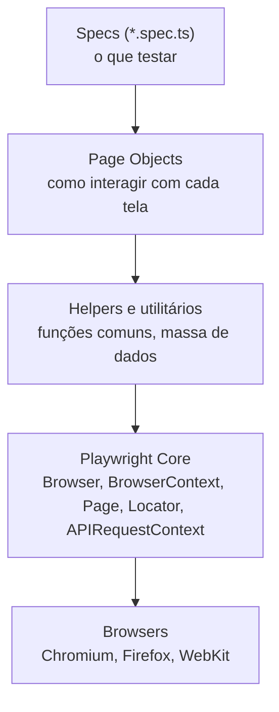
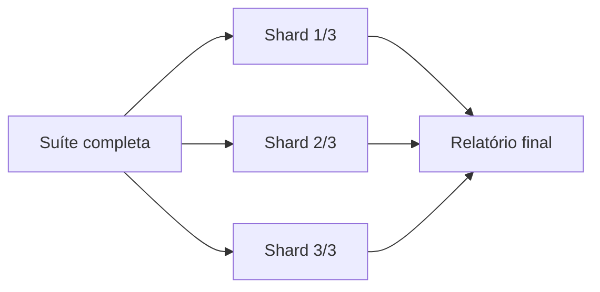
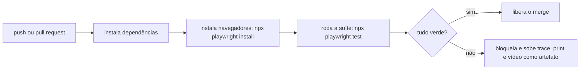

# Framework de Testes com Playwright e TypeScript

Escrever um teste que passa é fácil. Manter cem testes que rodam todo dia, num pipeline, sem virar uma bola de neve de código frágil, é o problema de verdade. É aí que entra a ideia de framework: um conjunto de decisões de estrutura, ferramentas e convenções em volta dos testes.

Esta nota mostra como um projeto de automação com Playwright e TypeScript costuma ser organizado. Ela é a porta de entrada da seção, as outras notas (como [asserções no Playwright](/labs/qa/automacao/02-assercoes-no-playwright/)) detalham partes específicas.

## O que é o Playwright

O Playwright é uma biblioteca Node.js, mantida pela Microsoft, para automatizar navegador. Com um API só você controla Chromium, Firefox e WebKit (o motor do Safari), incluindo versões mobile emuladas.

Ele vem em duas formas:

- **Playwright (biblioteca)**: só a automação do navegador. Você chama de dentro de qualquer script.
- **Playwright Test**: o test runner oficial, com `test()`, `expect()`, execução paralela, relatórios e configuração. É o que quase todo mundo usa para montar um framework de testes, e o que esta nota assume.

TypeScript não é obrigatório, mas ajuda bastante: autocomplete dos métodos do Playwright, erro na hora quando você troca o nome de um parâmetro, refatoração sem medo. O Playwright já vem com os tipos, então não tem configuração extra pra isso.

## Recursos que o Playwright já traz

Boa parte do que um framework "caseiro" precisaria construir já vem pronto:

- roda o mesmo teste em Chromium, Firefox e WebKit, e emula aparelhos móveis
- auto-wait: antes de clicar ou preencher, o Playwright espera o elemento aparecer e ficar utilizável, sem `sleep` no meio do teste
- actionability checks: ele confere se o elemento está visível, estável (parou de se mover), habilitado e recebendo eventos antes de agir
- execução paralela dos arquivos de teste, dividida entre vários processos
- Trace Viewer, screenshots e vídeos para entender por que um teste falhou
- interceptação de rede: dá para simular respostas de API, bloquear requisições, testar offline
- fixtures e hooks para preparar e limpar o cenário
- modo headless (sem janela, padrão no CI) e headful (com janela, bom para depurar)

## Arquitetura em camadas

A ideia central: o teste não fala direto com a página. Ele passa por camadas, cada uma com uma responsabilidade.



- **Specs**: os arquivos `*.spec.ts`. Descrevem cenários em linguagem próxima do negócio ("usuário faz login e vê o painel"). Não têm seletor de CSS solto no meio.
- **Page Objects**: uma classe por tela ou componente, guardando os locators e as ações daquela parte da aplicação.
- **Helpers e utilitários**: o que não é de uma tela específica. Geração de dados, leitura de variáveis de ambiente, formatação, chamadas de API para preparar cenário.
- **Playwright Core**: as classes do próprio Playwright. As principais são `Browser` (o navegador), `BrowserContext` (uma sessão isolada, tipo uma aba anônima), `Page` (uma aba), `Locator` (o endereço de um elemento) e `APIRequestContext` (para testes de API).
- **Browsers**: os navegadores de verdade que o Playwright baixa e controla.

Quando uma tela muda, você mexe no Page Object dela e os testes continuam de pé. Esse é o ganho de separar as camadas.

## Estrutura de pastas

Uma organização comum para um projeto Playwright + TypeScript:

```text
playwright-typescript-framework/
├── tests/
│   ├── login.spec.ts
│   └── dashboard.spec.ts
├── pages/
│   ├── LoginPage.ts
│   └── DashboardPage.ts
├── fixtures/
│   └── auth.fixture.ts
├── helpers/
│   ├── testData.ts
│   ├── utils.ts
│   └── constants.ts
├── config/
│   └── playwright.config.ts
├── reports/
├── test-results/
├── package.json
├── tsconfig.json
└── README.md
```

- `tests/` guarda os specs
- `pages/` guarda os Page Objects
- `fixtures/` guarda os setups reutilizáveis
- `helpers/` guarda utilitários e massa de dados
- `reports/` e `test-results/` são gerados nas execuções (entram no `.gitignore`)

Nada disso é lei. Times pequenos às vezes juntam `helpers/` e `fixtures/`. O importante é que a pasta diga o que tem dentro.

## Page Object Model

O Page Object Model (POM) é um padrão onde cada página vira uma classe. A classe concentra os locators e os métodos de ação daquela tela.

```ts
// pages/LoginPage.ts
import { Page, Locator } from "@playwright/test";

export class LoginPage {
  readonly page: Page;
  readonly email: Locator;
  readonly senha: Locator;
  readonly entrar: Locator;

  constructor(page: Page) {
    this.page = page;
    this.email = page.getByLabel("E-mail");
    this.senha = page.getByLabel("Senha");
    this.entrar = page.getByRole("button", { name: "Entrar" });
  }

  async fazerLogin(email: string, senha: string) {
    await this.email.fill(email);
    await this.senha.fill(senha);
    await this.entrar.click();
  }
}
```

O teste fica limpo:

```ts
const login = new LoginPage(page);
await login.fazerLogin("daniele@email.com", "senha123");
```

Um comentário honesto: no mundo Playwright o POM pesado é menos comum do que era no Selenium. O Playwright já resolve espera e estabilidade sozinho, e fixtures cobrem boa parte da reutilização. Vale usar POM onde ele paga o custo (telas grandes, reusadas em muitos testes) e não transformar toda tela de duas linhas numa classe. O `mapa-de-estudo` do lab resume isso como "Page Object Pattern com moderação".

## Locators

Locator é como o Playwright encontra um elemento na página. A ordem de preferência da documentação oficial:

- `getByRole('button', { name: 'Entrar' })` - pelo papel de acessibilidade e pelo texto acessível
- `getByLabel('E-mail')` - campos de formulário pelo rótulo
- `getByText('Bem-vinda')` - por texto visível
- `getByPlaceholder('Buscar')` - pelo placeholder
- `getByTestId('menu-usuario')` - por um atributo `data-testid` que o time coloca de propósito

CSS e XPath funcionam (`page.locator('.btn-primary')`), mas prendem o teste à estrutura do HTML e da folha de estilo. Trocou uma classe, quebrou o teste. Locators acessíveis quebram menos e ainda incentivam a aplicação a ser acessível.

## Fixtures e hooks

**Hook** é um trecho que roda em volta dos testes: `beforeEach`, `afterEach`, `beforeAll`, `afterAll`. Bom para coisas simples e locais.

**Fixture** é um recurso pronto que o teste recebe já montado na assinatura da função. O Playwright já entrega `page`, `context` e `browser` como fixtures. Você pode criar as suas com `test.extend()`:

```ts
// fixtures/auth.fixture.ts
import { test as base } from "@playwright/test";
import { LoginPage } from "../pages/LoginPage";

export const test = base.extend<{ paginaLogada: LoginPage }>({
  paginaLogada: async ({ page }, use) => {
    const login = new LoginPage(page);
    await page.goto("/login");
    await login.fazerLogin("daniele@email.com", "senha123");
    await use(login); // entrega pro teste
    // depois do teste, o que vier aqui é o teardown
  },
});
```

No teste, você só pede a fixture:

```ts
test("painel abre após login", async ({ page, paginaLogada }) => {
  await expect(page.getByRole("heading", { name: "Painel" })).toBeVisible();
});
```

Vantagem sobre hook: a fixture só roda quando algum teste realmente pede, e o setup fica isolado por recurso em vez de amontoado num `beforeEach` gigante.

## playwright.config.ts

O arquivo central de configuração. Um exemplo enxuto:

```ts
import { defineConfig, devices } from "@playwright/test";

export default defineConfig({
  testDir: "./tests",
  timeout: 30_000,
  retries: process.env.CI ? 2 : 0,
  use: {
    baseURL: "https://example.com",
    headless: true,
    screenshot: "only-on-failure",
    video: "retain-on-failure",
    trace: "retain-on-failure",
  },
  projects: [
    { name: "chromium", use: { ...devices["Desktop Chrome"] } },
    { name: "firefox", use: { ...devices["Desktop Firefox"] } },
    { name: "webkit", use: { ...devices["Desktop Safari"] } },
  ],
});
```

O que cada coisa faz:

- `testDir` - onde ficam os testes
- `timeout` - tempo máximo de cada teste
- `retries` - quantas vezes tentar de novo um teste que falhou. Comum colocar 2 no CI e 0 na máquina local, pra não mascarar teste instável durante o desenvolvimento
- `use.baseURL` - deixa você escrever `page.goto('/login')` em vez da URL inteira
- `screenshot: 'only-on-failure'` - guarda print só quando o teste falha
- `video` e `trace: 'retain-on-failure'` - grava vídeo e trace e descarta se o teste passou
- `projects` - cada navegador (ou aparelho) em que a suíte roda
- `workers` - quantos processos rodam testes em paralelo
- `use.viewport` - tamanho da janela do navegador
- `use.headless` - com ou sem janela

Para rodar em ambientes diferentes (dev, staging, produção), o padrão é ler a URL e credenciais de variáveis de ambiente e trocar por `.env` ou por parâmetro no comando, em vez de ter um config por ambiente.

## Execução paralela

Rodar cem testes um atrás do outro leva tempo demais. O Playwright divide a suíte entre **workers**: processos do sistema operacional separados, cada um com o próprio navegador. Quanto mais workers, mais testes rodam ao mesmo tempo.

Um detalhe que costuma ser mal entendido: por padrão, o paralelismo é **entre arquivos**. Os testes de um mesmo arquivo rodam em sequência, no mesmo worker. Se você tem dois arquivos com 50 testes cada, dois workers pegam um arquivo cada.

Para paralelizar também os testes dentro do arquivo:

```ts
// playwright.config.ts, vale para a suíte toda
export default defineConfig({
  fullyParallel: true,
});
```

```ts
// só para um grupo de testes de um arquivo
test.describe.configure({ mode: "parallel" });
```

O contrário também existe. Quando os testes de um grupo dependem um do outro, dá para usar `mode: 'serial'`: se um falha, os seguintes são pulados. Funciona, mas é um sinal de alerta, porque testes dependentes quebram a regra de independência. Prefira consertar os testes a usar serial.

Para controlar quantos workers rodam:

```ts
export default defineConfig({
  workers: process.env.CI ? 2 : undefined, // undefined = o Playwright decide pela CPU
});
```

```bash
npx playwright test --workers 4
npx playwright test --workers 1 # sem paralelismo, bom para depurar
```

Quando uma máquina só não dá conta, o **sharding** divide a suíte entre várias máquinas do CI. Cada máquina roda uma fatia:

```bash
npx playwright test --shard=1/3 # primeira de três fatias
```



Com paralelismo, o cuidado principal é com **dados compartilhados**. Se dois testes rodando ao mesmo tempo mexem no mesmo usuário ou no mesmo registro do banco, um atrapalha o outro e aparece aquele teste instável que só falha às vezes. A saída é cada teste criar os próprios dados (um usuário com e-mail único, por exemplo) e não depender de estado deixado por outro. O [isolamento por context](/labs/qa/automacao/03-browser-context-e-page/) cuida do lado do navegador, o lado dos dados é com você.

Detalhes e o modo de travas para recursos compartilhados estão na [documentação de paralelismo](https://playwright.dev/docs/test-parallel).

## Relatórios e artefatos

Quando um teste falha no pipeline, você não estava olhando. Os artefatos contam o que aconteceu:

- **HTML report**: relatório navegável nativo, com cada teste, o tempo, o erro e os anexos
- **Trace Viewer**: a joia da coroa. Uma linha do tempo do teste com print de cada passo, estado do DOM, requisições de rede e console. Abre com `npx playwright show-trace trace.zip`
- **screenshots e vídeos** de falha, anexados ao relatório
- **reporters extras** como o Allure, quando o time já usa esse padrão em outros projetos

## Integração com CI/CD

O valor da automação aparece quando ela roda sozinha a cada mudança. Fluxo típico com GitHub Actions:



Dois pontos que fazem diferença: subir os artefatos do Playwright como artifact do job (pra você baixar o trace da falha) e usar a suíte como quality gate, ou seja, PR não entra com teste vermelho.

## Boas práticas

- **testes independentes**: cada teste cria o próprio cenário e não depende da ordem nem do resultado de outro
- **atômicos**: um teste verifica uma coisa. Se ele falha, você sabe na hora o que quebrou
- **locators significativos**: role, label, texto, test id, antes de CSS ou XPath
- **fixtures para setup e teardown**: em vez de repetir o mesmo preparo em todo arquivo
- **rodar em paralelo**: feedback em minutos, não em meia hora
- **Trace Viewer para depurar**: olhar a linha do tempo da falha em vez de adivinhar e reexecutar
- **CI/CD desde o começo**: um teste que só roda na sua máquina protege pouca gente

## Referências

- [Playwright: Introdução](https://playwright.dev/docs/intro) - Playwright (documentação oficial), en
- [Library vs Test Runner](https://playwright.dev/docs/library) - Playwright (documentação oficial), en
- [Locators](https://playwright.dev/docs/locators) - Playwright (documentação oficial), en
- [Fixtures](https://playwright.dev/docs/test-fixtures) - Playwright (documentação oficial), en
- [Test configuration](https://playwright.dev/docs/test-configuration) - Playwright (documentação oficial), en
- [Best Practices](https://playwright.dev/docs/best-practices) - Playwright (documentação oficial), en
