# Asserções no Playwright

Um teste automatizado que não verifica nada não testa nada. Ele abre a página, clica em alguns botões, e termina "verde" mesmo que a tela esteja toda quebrada. Quem faz o teste realmente checar alguma coisa é a asserção.

Esta nota é uma referência rápida das asserções mais usadas no [Playwright](https://playwright.dev), a partir do `expect` que vem no `@playwright/test`. Serve de colinha para quem está montando os primeiros testes ou revisando para entrevista.

## O que é uma asserção

Asserção é a linha do teste que compara o resultado obtido com o resultado esperado. Se bate, o teste segue. Se não bate, o teste falha ali e o Playwright mostra o que era esperado e o que apareceu.

Num teste Playwright, o fluxo costuma ser: preparar o cenário, agir (navegar, clicar, preencher) e então verificar. A asserção é a etapa de verificar.

```js
import { test, expect } from "@playwright/test";

test("a home mostra o título certo", async ({ page }) => {
  await page.goto("https://playwright.dev");
  await expect(page).toHaveTitle(/Playwright/); // asserção
});
```

Por que vale a pena caprichar nas asserções:

- confirmam que o comportamento aconteceu de verdade, não só que o código não estourou
- pegam o bug perto de onde ele nasce, com mensagem clara
- deixam o teste confiável, dá para confiar no verde
- documentam o que a tela deveria fazer, pra quem ler o teste depois

## Asserção com auto-wait x asserção genérica

Essa é a distinção mais importante da nota, e a que mais confunde quem vem de outras ferramentas.

O Playwright separa as asserções em dois grupos:

**Asserções de locator (web-first)** esperam a condição acontecer. Quando você escreve `await expect(locator).toBeVisible()`, o Playwright fica re-checando o elemento no DOM a cada ~100 ms até a condição virar verdadeira ou até estourar o timeout (5 segundos por padrão). Só falha se o tempo acabar. Isso elimina quase toda a "flakiness" (aquele teste que passa às vezes e falha às vezes) sem você precisar colocar `sleep` no meio do teste.

**Asserções genéricas** são síncronas. Verificam o valor naquele instante e pronto, não tentam de novo. São para dados que já estão na mão: um número, uma string, um array.

```mermaid
flowchart TD
  A["await expect(locator).toBeVisible()"] --> B{elemento visível agora?}
  B -->|sim| C[passa]
  B -->|não| D{estourou o timeout de 5s?}
  D -->|não| E[espera ~100ms e checa de novo]
  E --> B
  D -->|sim| F[falha e mostra o estado atual]
```



Regra prática: se a asserção é sobre algo na tela, use uma asserção de locator e coloque `await` na frente. Se é sobre um valor que você já calculou, use a asserção genérica, sem `await`.

Esquecer o `await` numa asserção de locator é um erro clássico: o teste passa sempre, porque ninguém espera a verificação terminar.

## Asserções genéricas

Para valores que não são de tela: números, strings, arrays, objetos.

| Asserção                           | O que verifica                                                         |
| ---------------------------------- | ---------------------------------------------------------------------- |
| `expect(valor).toBe(esperado)`     | igualdade estrita (`===`), bom para número, string, boolean            |
| `expect(valor).toEqual(esperado)`  | igualdade profunda, compara o conteúdo de objetos e arrays             |
| `expect(valor).not.toBe(esperado)` | o contrário: os valores têm que ser diferentes                         |
| `expect(valor).toBeTruthy()`       | o valor é "verdadeiro" (não é `false`, `0`, `''`, `null`, `undefined`) |
| `expect(valor).toBeFalsy()`        | o valor é "falso"                                                      |
| `expect(valor).toContain(item)`    | o array contém o item, ou a string contém o trecho                     |
| `expect(valor).toHaveLength(n)`    | o array ou string tem tamanho `n`                                      |
| `expect(valor).toBeGreaterThan(n)` | número maior que `n`                                                   |
| `expect(valor).toBeLessThan(n)`    | número menor que `n`                                                   |
| `expect(valor).toMatch(/regex/)`   | a string casa com a expressão regular                                  |

```js
const itens = [1, 2, 3, 4];
expect(itens).toHaveLength(4);
expect(itens).toContain(3);
expect(itens[0]).toBeLessThan(itens[3]);
```

## Asserções de locator

Todas fazem `await`, auto-wait e auto-retry. O locator é o "endereço" do elemento na página, algo como `page.getByRole('button', { name: 'Entrar' })`.

Visibilidade e estado:

```js
await expect(locator).toBeVisible(); // elemento aparece na tela
await expect(locator).toBeHidden(); // elemento não aparece
await expect(locator).toBeEnabled(); // habilitado, dá pra interagir
await expect(locator).toBeDisabled(); // desabilitado
await expect(locator).toBeChecked(); // checkbox ou radio marcado
```

Texto e valor:

```js
await expect(locator).toHaveText("Bem-vinda"); // texto exato
await expect(locator).toContainText("Bem"); // contém o trecho
await expect(locator).toHaveValue("daniele@email.com"); // valor de input/select
```

Atributos e estilo:

```js
await expect(locator).toHaveAttribute("href", "/conta");
await expect(locator).toHaveClass(/ativo/);
await expect(locator).toHaveCSS("display", "flex");
```

Layout e contagem:

```js
await expect(locator).toBeInViewport(); // está na área visível da janela
await expect(page.getByRole("listitem")).toHaveCount(5); // são 5 itens na lista
```

A lista oficial tem mais matchers de locator (`toBeEditable`, `toBeFocused`, `toHaveId`, `toHaveRole`, `toMatchAriaSnapshot` e outros). Os de cima são os que aparecem no dia a dia.

## Asserções negativas

Todas as asserções aceitam `.not` na frente para inverter:

```js
await expect(page.getByText("Erro")).not.toBeVisible();
expect(resposta.status).not.toBe(500);
```

Um detalhe sobre `.not` em asserção de locator: `not.toBeVisible()` espera o elemento sumir (ou nunca aparecer) durante o timeout. Se você quer confirmar que algo "não apareceu", isso funciona, mas o teste vai gastar os 5 segundos inteiros esperando quando o elemento realmente não existe. Em cenários assim, às vezes vale reduzir o timeout daquela asserção específica.

## Asserções soft

Por padrão, a primeira asserção que falha derruba o teste, e as linhas seguintes nem rodam. A asserção soft muda isso: ela marca o teste como falho, mas deixa a execução continuar.

```js
await expect.soft(page.getByTestId("nome")).toHaveText("Daniele");
await expect.soft(page.getByTestId("email")).toHaveText("daniele@email.com");
await expect.soft(page.getByTestId("plano")).toHaveText("Pro");
// se as três falharem, o relatório mostra as três de uma vez
```

É útil quando você quer ver todos os problemas de uma tela num relatório só, em vez de corrigir um, rodar de novo, achar o próximo. Use com parcimônia: se uma asserção soft falha e o resto do teste depende daquele estado, as falhas seguintes podem virar ruído.

## Mensagens personalizadas

O `expect` aceita um segundo argumento com uma mensagem que aparece quando a asserção falha. Ajuda a entender o relatório sem abrir o código.

```js
await expect(
  page.getByRole("button", { name: "Finalizar compra" }),
  "o botão de finalizar deveria aparecer após adicionar um item ao carrinho",
).toBeVisible();
```

## Exemplo completo

Um teste juntando asserção de página, de locator e genérica:

```js
import { test, expect } from "@playwright/test";

test("fluxo de busca na doc do Playwright", async ({ page }) => {
  await page.goto("https://playwright.dev");

  // asserção de página
  await expect(page).toHaveTitle(/Playwright/);

  // ação
  await page.getByRole("button", { name: "Search" }).click();
  await page.getByPlaceholder("Search docs").fill("assertions");

  // asserção de locator
  const resultados = page.getByRole("listitem");
  await expect(resultados.first()).toContainText("assertions");

  // asserção genérica
  const total = await resultados.count();
  expect(total).toBeGreaterThan(0);
});
```

## Referências

- [Assertions](https://playwright.dev/docs/test-assertions) - Playwright (documentação oficial), en
- [Auto-waiting](https://playwright.dev/docs/actionability) - Playwright (documentação oficial), en
- [Best Practices](https://playwright.dev/docs/best-practices) - Playwright (documentação oficial), en
- [Playwright Waits: Auto-Waiting, Assertions, and Best Practices](https://www.browserstack.com/guide/playwright-wait-types) - BrowserStack, en
