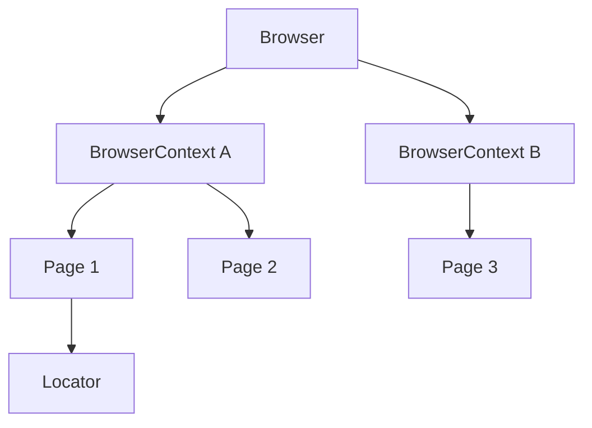

# Browser, Context e Page no Playwright

Quando você escreve `await page.goto(...)`, tem uma cadeia inteira por trás: um navegador foi aberto, uma sessão isolada foi criada e uma aba foi aberta dentro dela. Entender essa cadeia explica por que os testes do Playwright não se atrapalham entre si e como simular, por exemplo, dois usuários conversando no mesmo teste.

Esta nota complementa o [framework com Playwright e TypeScript](/labs/qa/automacao/01-framework-playwright-typescript/) e a de [asserções](/labs/qa/automacao/02-assercoes-no-playwright/), olhando para as classes de baixo nível do Playwright.

## Do navegador à página

O Playwright organiza tudo em uma hierarquia, do maior para o menor:

- **Browser**: o navegador em si (Chromium, Firefox ou WebKit), uma instância aberta pelo Playwright
- **BrowserContext**: uma sessão isolada dentro do navegador, com cookies e storage próprios
- **Page**: uma aba dentro de um context
- **Locator**: o endereço de um elemento dentro da página



Um teste típico percorre essa cadeia inteira: abre o navegador, cria um context, abre uma página, localiza um elemento, age sobre ele, verifica o resultado com uma asserção e gera o relatório. Em resumo: Browser, Context, Page, Locator, Action, Assertion, Report.

Quem usa o **Playwright Test** quase nunca cria isso na mão. O runner entrega `browser`, `context` e `page` prontos como [fixtures](/labs/qa/automacao/01-framework-playwright-typescript/), e cada teste ganha um `context` e um `page` novinhos. Já quem usa o Playwright como **biblioteca** (num script comum) monta a cadeia sozinho:

```ts
import { chromium } from "playwright";

const browser = await chromium.launch();
const context = await browser.newContext();
const page = await context.newPage();

await page.goto("https://playwright.dev");
await browser.close();
```

## Browser launch

Abrir o navegador é o primeiro passo, e a principal escolha é entre dois modos:

- **Headless**: o navegador roda sem janela visível. É o padrão e o modo do CI, porque é mais leve e não precisa de tela.
- **Headed**: o navegador abre com janela. É ótimo para depurar, porque você vê o teste acontecendo.

Você alterna o modo de três jeitos:

```ts
// 1. Na biblioteca, ao abrir o navegador
const browser = await chromium.launch({ headless: false });
```

```ts
// 2. No playwright.config.ts, para a suíte inteira
export default defineConfig({
  use: { headless: false },
});
```

```bash
# 3. Na linha de comando, só naquela execução
npx playwright test --headed
```

Uma dica prática: rode headless no dia a dia e no CI, e use `--headed` (ou o modo UI, `--ui`) só quando um teste falhar e você quiser entender o porquê.

## Browser Context

O context é a peça mais importante desta nota. Pense nele como uma **janela anônima**: tem cookies, `localStorage`, sessão e cache próprios, totalmente separados dos de outros contexts, mesmo dentro do mesmo navegador.

### Isolamento entre testes

No Playwright Test, cada teste roda no seu próprio context. Isso quer dizer que:

- o login feito no teste A não vaza para o teste B
- um carrinho cheio num teste não aparece no outro
- se um teste falha, ele não contamina os seguintes, e você só precisa olhar aquele teste para depurar

É isso que sustenta a boa prática de testes independentes: o isolamento vem de graça, você não precisa limpar cookies na mão.

E o custo? Criar um context é rápido e barato, bem mais do que abrir um navegador novo. Por isso o Playwright pode dar um context novo para cada teste sem deixar a suíte lenta.

### Múltiplos usuários no mesmo teste

Como cada context é uma sessão separada, dois contexts são dois usuários diferentes. Serve para testar fluxos que envolvem mais de uma pessoa, como um chat ou uma aprovação:

```ts
import { test, expect } from "@playwright/test";

test("admin aprova o pedido feito pelo cliente", async ({ browser }) => {
  const clienteContext = await browser.newContext();
  const adminContext = await browser.newContext();

  const clientePage = await clienteContext.newPage();
  const adminPage = await adminContext.newPage();

  await clientePage.goto("/pedidos/novo");
  // ... cliente faz o pedido

  await adminPage.goto("/admin/pedidos");
  // ... admin aprova

  await expect(clientePage.getByText("Pedido aprovado")).toBeVisible();

  await clienteContext.close();
  await adminContext.close();
});
```

Note o `close()` no final: contexts criados na mão com `browser.newContext()` são responsabilidade sua. Os que o runner entrega pelas fixtures ele fecha sozinho.

### Opções de um context

`newContext()` aceita configurações que valem só para aquela sessão:

```ts
const context = await browser.newContext({
  viewport: { width: 375, height: 812 }, // tamanho de tela de celular
  locale: "pt-BR", // idioma do navegador
  permissions: ["geolocation"], // permissões concedidas
  storageState: "auth.json", // sessão logada já salva
});
```

O `storageState` merece destaque: você faz login uma vez, salva cookies e storage num arquivo e reaproveita nos outros testes, sem repetir a tela de login toda vez. No Playwright Test as mesmas opções ficam em `use` no `playwright.config.ts`.

## Page

A `Page` é **uma aba** do navegador, dentro de um context. É nela que você navega e interage com a aplicação. Os três métodos mais básicos:

```ts
await page.goto("https://playwright.dev"); // navega até a URL
console.log(await page.title()); // título da página
console.log(page.url()); // URL atual
```

Repare que `title()` é assíncrono (tem `await`) e `url()` não. O `title()` precisa perguntar ao navegador, o `url()` só devolve o que o Playwright já sabe.

Para verificar título e URL num teste, prefira as asserções `toHaveTitle()` e `toHaveURL()`, que esperam a condição em vez de ler o valor uma vez só (veja [asserções no Playwright](/labs/qa/automacao/02-assercoes-no-playwright/)).

### Várias páginas no mesmo context

Um mesmo context pode ter mais de uma página, e todas compartilham a sessão (o login vale nas duas). Isso acontece, por exemplo, quando um clique abre uma nova aba ou um popup:

```ts
const [novaAba] = await Promise.all([
  context.waitForEvent("page"), // fica escutando a abertura de uma aba
  page.getByRole("link", { name: "Termos de uso" }).click(),
]);

await novaAba.waitForLoadState();
await expect(novaAba).toHaveURL(/termos/);
```

O `Promise.all` garante que você começa a escutar o evento antes do clique, senão a aba pode abrir antes de você perceber.

## Page actions

As actions são os métodos da `Page` (e do `Locator`) que fazem algo na tela. Dividem-se em dois grupos.

**Navegação:**

- `page.goto(url)` - abre uma URL
- `page.reload()` - recarrega a página
- `page.goBack()` e `page.goForward()` - andam no histórico do navegador

**Interações:**

- `click()` - clica em um elemento
- `fill('texto')` - limpa o campo e preenche com o texto
- `check()` e `uncheck()` - marcam e desmarcam checkbox e radio
- `selectOption('valor')` - escolhe uma opção de um `<select>`
- `press('Enter')` - aperta uma tecla

Quase todas as interações são chamadas em cima de um locator:

```ts
await page.getByLabel("E-mail").fill("daniele@email.com");
await page.getByRole("checkbox", { name: "Lembrar de mim" }).check();
await page.getByRole("button", { name: "Entrar" }).click();
```

E antes de agir, o Playwright faz o **auto-wait**: espera o elemento existir, ficar visível, estável e habilitado. É por isso que você quase não vê `sleep` ou `waitForTimeout` num teste bem escrito. Se o elemento nunca ficar utilizável, a action falha com timeout e uma mensagem dizendo qual verificação não passou.

## Referências

- [Isolation](https://playwright.dev/docs/browser-contexts) - Playwright (documentação oficial), en
- [Pages](https://playwright.dev/docs/pages) - Playwright (documentação oficial), en
- [Library vs Test Runner](https://playwright.dev/docs/library) - Playwright (documentação oficial), en
- [Authentication](https://playwright.dev/docs/auth) - Playwright (documentação oficial), en
- [Auto-waiting](https://playwright.dev/docs/actionability) - Playwright (documentação oficial), en
