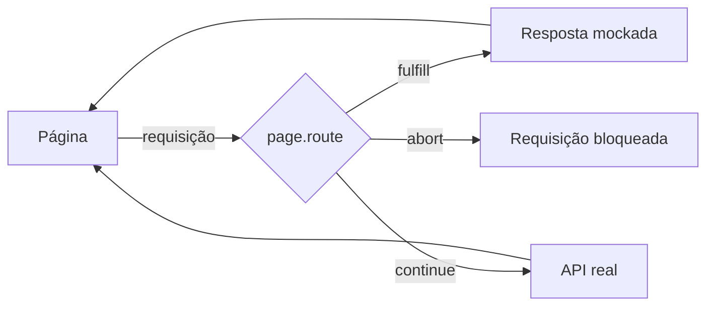

# Interceptação de Rede e Mocks no Playwright

Todo teste de UI que depende de um backend real herda os problemas dele: fica lento, quebra quando o ambiente de staging cai e não consegue reproduzir cenários raros. O Playwright resolve isso deixando você **ficar no meio do caminho** entre o navegador e a API. Cada requisição que a página faz pode ser observada, alterada, respondida por você ou bloqueada.

Esta nota assume que você já conhece [Browser, Context e Page](/labs/qa/automacao/03-browser-context-e-page/) e o básico do [framework com Playwright](/labs/qa/automacao/01-framework-playwright-typescript/).

## Por que interceptar a rede

Três motivos que aparecem o tempo todo:

- **Estabilidade**: se a API de staging está fora do ar, o teste de tela não precisa falhar por isso
- **Cenários difíceis de reproduzir**: como forçar um erro 500, uma lista vazia ou uma resposta que demora 10 segundos no backend de verdade? Com mock, é uma linha
- **Verificar o que o front envia**: dá para conferir se o clique em "Finalizar compra" mandou o payload correto para a API



## page.route e context.route

O ponto de entrada é o método `route`. Você diz **qual URL** quer interceptar e **o que fazer** com ela:

```ts
await page.route("**/api/produtos", async (route) => {
  // aqui você decide o destino da requisição
});
```

A URL aceita glob (`**/api/produtos`, onde `**` casa qualquer prefixo) ou expressão regular (`/\/api\/produtos\?page=\d+/`).

Existem duas versões:

- `page.route()` vale só para aquela página
- `context.route()` vale para todas as páginas do context, inclusive abas que abrirem depois

Na maioria dos testes, `page.route()` basta. Use o do context quando o teste abrir várias abas e todas precisarem do mesmo mock.

Um detalhe que pega iniciante: registre o `route` **antes** de navegar. Se a página já disparou a requisição, o mock chega tarde demais.

## O que fazer com a requisição

Dentro do handler você tem quatro opções.

### route.fulfill: responder com dado mockado

O navegador acha que a API respondeu, mas quem respondeu foi o seu teste:

```ts
await page.route("**/api/produtos", (route) =>
  route.fulfill({
    status: 200,
    contentType: "application/json",
    body: JSON.stringify([
      { id: 1, nome: "Camiseta", preco: 59.9 },
      { id: 2, nome: "Caneca", preco: 29.9 },
    ]),
  }),
);

await page.goto("/produtos");
await expect(page.getByRole("listitem")).toHaveCount(2);
```

Nenhuma chamada saiu para o backend, então o teste é rápido e não depende de dados que podem mudar.

### route.abort: bloquear

Corta a requisição. Serve para acelerar testes bloqueando o que não importa (imagens, fontes, scripts de analytics de terceiros) ou para simular falha de conexão:

```ts
await page.route("**/*.{png,jpg,jpeg}", (route) => route.abort());
```

### route.continue: deixar passar

A requisição segue para o servidor real. Sozinho parece inútil, mas você pode alterar headers, método ou body no caminho:

```ts
await page.route("**/api/**", (route) =>
  route.continue({
    headers: { ...route.request().headers(), "x-ambiente": "teste" },
  }),
);
```

### route.fetch: alterar só parte da resposta real

Às vezes você quer a resposta verdadeira, mas com um campo modificado. O `route.fetch()` faz a chamada real e devolve a resposta para você mexer antes de entregar ao navegador:

```ts
await page.route("**/api/perfil", async (route) => {
  const resposta = await route.fetch();
  const dados = await resposta.json();
  dados.plano = "Pro"; // força um estado que o usuário de teste não tem

  await route.fulfill({ response: resposta, json: dados });
});
```

Aqui o meio-termo é interessante: a estrutura da resposta continua sendo a da API real (se o contrato mudar, você percebe), e só o campo que interessa é forçado.

## Simular respostas do backend

Os cenários que mais valem o esforço são os que o backend real dificilmente entrega:

**Erro 500**, para conferir se a tela mostra uma mensagem decente:

```ts
await page.route("**/api/pedidos", (route) =>
  route.fulfill({ status: 500, body: "Erro interno" }),
);

await page.goto("/pedidos");
await expect(
  page.getByText("Não foi possível carregar seus pedidos"),
).toBeVisible();
```

**Lista vazia**, para testar o estado vazio ("Você ainda não tem pedidos"):

```ts
await page.route("**/api/pedidos", (route) => route.fulfill({ json: [] }));
```

**Resposta lenta**, para ver o estado de carregamento:

```ts
await page.route("**/api/pedidos", async (route) => {
  await new Promise((resolve) => setTimeout(resolve, 3000));
  await route.fulfill({ json: [] });
});

await page.goto("/pedidos");
await expect(page.getByRole("progressbar")).toBeVisible();
```

Testar esses caminhos "tristes" é onde a interceptação mais se paga, porque são justamente os que ninguém clica manualmente.

## Validar chamadas de API

Nem sempre você quer trocar a resposta. Às vezes só precisa **conferir o que aconteceu** na rede. Para isso o Playwright tem esperas específicas:

```ts
const [requisicao] = await Promise.all([
  page.waitForRequest("**/api/pedidos"),
  page.getByRole("button", { name: "Finalizar compra" }).click(),
]);

expect(requisicao.method()).toBe("POST");
expect(requisicao.postDataJSON()).toMatchObject({ itens: 2 });
```

E do lado da resposta:

```ts
const [resposta] = await Promise.all([
  page.waitForResponse("**/api/pedidos"),
  page.getByRole("button", { name: "Finalizar compra" }).click(),
]);

expect(resposta.status()).toBe(201);
```

O `Promise.all` é o mesmo truque de sempre: começar a escutar **antes** de disparar a ação, para não perder a requisição.

Se você quer só observar tudo o que passa, sem esperar nada específico, dá para escutar os eventos:

```ts
page.on("request", (req) => console.log(">>", req.method(), req.url()));
page.on("response", (res) => console.log("<<", res.status(), res.url()));
```

Bom para depurar: em dois minutos você descobre quais chamadas a tela realmente faz.

## HAR replay

Escrever mock à mão para uma tela com 15 chamadas cansa. O **HAR** (HTTP Archive) é um arquivo que registra todo o tráfego de uma navegação, e o Playwright sabe gravar e reproduzir esse arquivo.

Para gravar:

```bash
npx playwright codegen --save-har=trafego.har https://exemplo.com
```

Para reproduzir num teste:

```ts
await page.routeFromHAR("trafego.har", { url: "**/api/**" });
await page.goto("/produtos");
```

As requisições que casam com o padrão são respondidas pelo arquivo, sem sair para a rede. O ponto fraco: o HAR é uma foto de um momento. Se a API mudar, o arquivo fica velho e o teste continua passando com dados que não existem mais, então vale regravar de tempos em tempos.

## Cuidados

**Mock demais esconde bug.** Se todos os seus testes usam resposta mockada, nenhum deles descobre que o front e o backend deixaram de se entender. Uma divisão saudável:

- testes de UI com mock: cobrem estados da tela (erro, vazio, carregando) de forma rápida e determinística
- poucos testes E2E com backend real: garantem que as peças realmente conversam

**Service workers escapam do route.** Se a aplicação registra um service worker (comum em PWAs), ele pode responder requisições sem que o Playwright veja. Para garantir que seus mocks funcionem, bloqueie no config:

```ts
export default defineConfig({
  use: { serviceWorkers: "block" },
});
```

**Mock não é contrato.** O dado que você inventa no `fulfill` pode divergir do que a API de verdade devolve. Para evitar isso, veja [testes de contrato](/labs/qa/praticas/05-testes-de-contrato/): eles verificam que o formato que o front espera é o mesmo que o backend entrega, e assim seus mocks ficam honestos.

## Referências

- [Network](https://playwright.dev/docs/network) - Playwright (documentação oficial), en
- [Mock APIs](https://playwright.dev/docs/mock) - Playwright (documentação oficial), en
- [Best Practices](https://playwright.dev/docs/best-practices) - Playwright (documentação oficial), en
