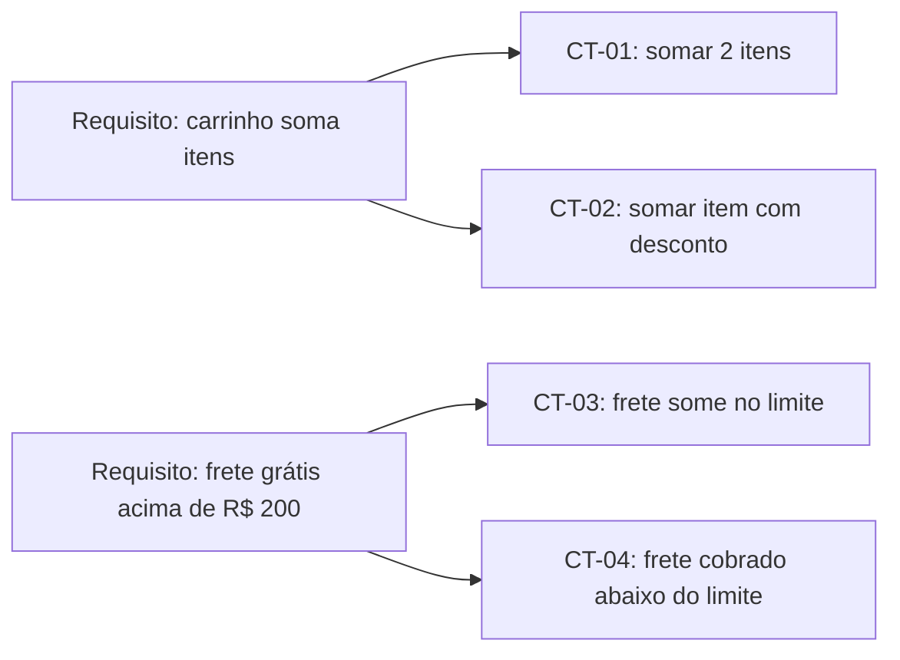
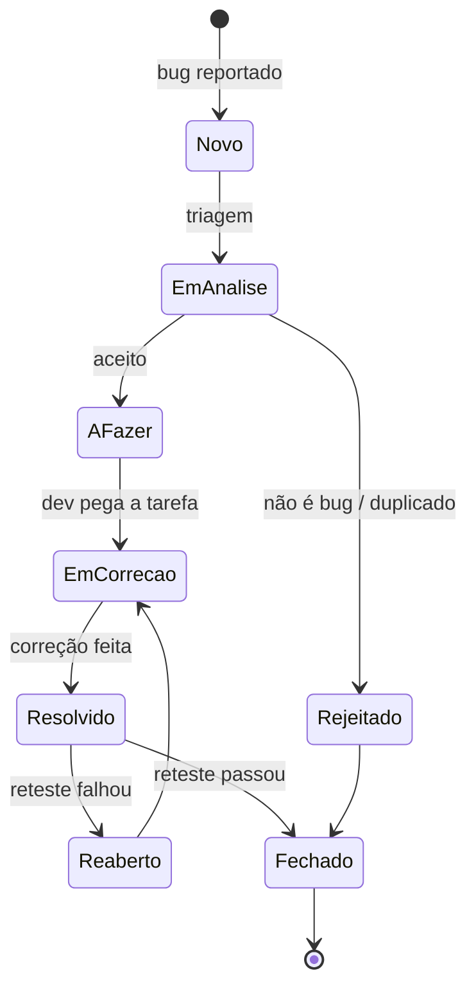
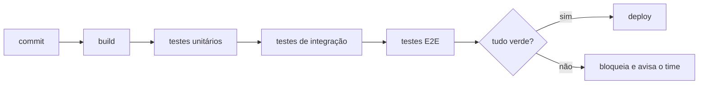
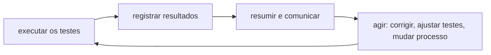

# Terminologias de QA

Esta página funciona como um glossário. Não precisa ser lida de ponta a ponta: use como consulta quando um termo aparecer numa conversa, num plano de teste ou num relatório de bug e você quiser confirmar o que ele significa.

## Por que ter um vocabulário comum

Quando cada pessoa do time chama a mesma coisa por um nome diferente, a conversa trava. Alguém pede um "teste de regressão" pensando em rodar a suíte inteira, outra pessoa entende "dar uma olhada rápida na tela que mudou", e o combinado sai furado.

Ter os termos alinhados evita esse tipo de ruído. Também ajuda quem está começando a ler documentação, vagas de emprego e discussões técnicas sem se perder. Boa parte do vocabulário abaixo vem do glossário do ISTQB, que é a referência mais usada na área e tem tradução oficial para o português feita pelo BSTQB.

Um aviso: alguns termos têm uma definição no glossário e um uso um pouco diferente no dia a dia das empresas. Quando isso acontece, a página aponta as duas visões.

## Desenho e planejamento de testes

São os artefatos que descrevem o que vai ser testado, antes de qualquer execução.

### Cenário de teste (test scenario)

Uma ideia de alto nível do que testar, escrita em uma frase. Não tem passo a passo nem dado específico. Serve para mapear a cobertura antes de detalhar.

Exemplo: "Login com credenciais válidas", "Login com senha errada", "Login com conta bloqueada".

### Caso de teste (test case)

O detalhamento de um cenário. Um caso de teste costuma ter:

- pré-condições (o que precisa estar pronto antes)
- passos para executar
- dados de entrada
- resultado esperado

Do cenário "Login com senha errada" sai um caso de teste como: "Dado um usuário cadastrado, quando informo o e-mail correto e uma senha inválida, então o sistema exibe a mensagem 'Credenciais inválidas' e não faz login".

### Suíte de testes (test suite)

Um conjunto de casos de teste agrupados por algum critério: mesma funcionalidade, mesmo tipo, mesma release. "Suíte de regressão do checkout" é uma suíte.

### Massa de dados de teste (test data)

As entradas usadas durante a execução: usuários, produtos, valores, arquivos. Preparar massa de dados costuma dar mais trabalho do que parece, principalmente quando o teste depende de um estado específico do banco.

### Plano de teste (test plan)

Um documento que descreve escopo, estratégia, o que está dentro e fora, recursos necessários, riscos e cronograma. Em time ágil raramente existe um plano formal e extenso; costuma ser um documento enxuto, ou nem isso. Em contextos mais regulados (banco, saúde, governo) o plano detalhado ainda é comum e às vezes obrigatório.

### Critérios de entrada e saída (entry/exit criteria)

Duas listas de condições combinadas com o time, normalmente escritas no plano de teste.

O critério de entrada diz o que precisa estar pronto para valer a pena começar a testar: ambiente no ar, build implantado, casos de teste escritos, requisitos aprovados. Começar antes disso costuma render retrabalho, você testa em cima de algo que ainda vai mudar.

O critério de saída diz quando dá para considerar a atividade de teste concluída. Ele evita as duas armadilhas comuns: parar cedo demais ("deu a hora, vamos entregar") ou testar para sempre sem um alvo claro. Formas comuns de expressar:

| Critério de saída  | Exemplo                                                                |
| ------------------ | ---------------------------------------------------------------------- |
| Cobertura          | todos os requisitos da release têm ao menos um caso de teste executado |
| Execução           | 100% dos casos planejados executados, 95% aprovados                    |
| Defeitos em aberto | nenhum defeito de severidade alta ou crítica sem correção              |
| Tempo              | fim da janela de testes acordada (usado com cautela, sozinho é fraco)  |

Na prática, o critério de saída raramente é atingido por inteiro. Quando falta pouco, o time avalia o risco do que ficou de fora e decide seguir ou não. Essa avaliação entra no relatório de resumo dos testes.

### Matriz de rastreabilidade de requisitos (RTM)

Uma tabela que liga cada requisito aos casos de teste que o verificam, e vice-versa. Serve para responder duas perguntas:

- esse requisito tem teste cobrindo ele?
- se esse requisito mudar, quais testes preciso revisar?



### Cobertura de teste (test coverage)

O percentual de alguma coisa que os testes exercitam: requisitos cobertos, linhas de código executadas, ramos de decisão percorridos.

Cobertura alta é bom sinal, mas não garante ausência de bugs. Dá para ter 100% das linhas executadas e ainda assim errar, porque a linha rodou com um valor que não expõe o problema. Cobertura mede o que foi tocado, não o que foi bem verificado.

## Tipos de teste

A lista abaixo não é uma taxonomia rígida. Um mesmo teste pode ser, ao mesmo tempo, funcional, de integração e de regressão. Os nomes descrevem o foco ou o momento, não caixas exclusivas.

### Funcional x não funcional

Teste funcional verifica o que o sistema faz: a regra de negócio, o cálculo, o fluxo. "O desconto de 10% foi aplicado?" é funcional.

Teste não funcional verifica como o sistema se comporta: desempenho, segurança, usabilidade, acessibilidade. "A página respondeu em menos de 2 segundos com 500 usuários simultâneos?" é não funcional.

### Teste de integração

Verifica a comunicação entre partes: dois módulos, o sistema e o banco, o sistema e uma API externa. O objetivo é pegar problemas na fronteira, como formato de dado trocado, campo faltando ou erro que não é tratado.

### Teste de sistema

Verifica o sistema completo, montado, do jeito mais próximo possível do ambiente real. Olha o fluxo de ponta a ponta em vez de componentes isolados.

### Teste de aceitação e UAT

Teste de aceitação verifica se o sistema atende ao que foi combinado e está pronto para ser entregue. Quando quem executa é a pessoa usuária ou o cliente, chamamos de UAT (User Acceptance Testing, teste de aceitação do usuário). O foco não é caçar bug, é confirmar que aquilo resolve o problema de quem pediu.

### Teste de fumaça (smoke test)

Uma verificação ampla e rasa logo depois de um build novo, para responder uma pergunta: dá para testar isso ou o build está quebrado? Passa por vários fluxos principais sem se aprofundar em nenhum. Se o smoke falha, nem adianta continuar, o time volta pro conserto.

O nome vem da eletrônica: liga a placa e vê se sai fumaça.

### Teste de sanidade (sanity test)

Uma verificação estreita e focada, feita para confirmar que uma correção ou mudança pontual funcionou, antes de investir em um teste mais completo. É mais fundo que o smoke, mas em uma área só.

No glossário do ISTQB, "sanity test" aparece como sinônimo de smoke test. Na prática do mercado, muita gente separa os dois assim: smoke é amplo e raso (a build está de pé?), sanity é estreito e um pouco mais fundo (essa correção específica ficou boa?). Vale conhecer as duas visões porque você vai encontrar as duas.

### Teste de regressão

Confirma que uma mudança nova não quebrou o que já funcionava. É o teste que mais cresce com o tempo e o principal candidato à automação, justamente porque ninguém aguenta reexecutar a mesma bateria manual a cada release.

### Teste de confirmação (reteste)

Depois que um bug é corrigido, você reexecuta exatamente o caso de teste que falhou para confirmar que agora passa. O glossário do ISTQB chama isso de teste de confirmação; "reteste" é o apelido informal.

A diferença para a regressão: o reteste olha o bug que foi corrigido, a regressão olha se a correção estragou outra coisa. Normalmente você faz os dois.

### Teste de desempenho (performance)

Verifica o comportamento sob carga: tempo de resposta, throughput (quantas requisições por segundo), uso de recursos, estabilidade ao longo do tempo. Tem subtipos com nomes próprios, como teste de carga (comportamento na carga esperada) e teste de estresse (comportamento acima do limite, até quebrar).

### Teste de segurança

Procura vulnerabilidades e falhas de proteção: dados expostos, permissão que não é checada, injeção de código, senha guardada em texto puro. É uma área especializada, mas alguns testes básicos cabem no dia a dia de qualquer QA.

### Teste exploratório

Aprender sobre o sistema, desenhar testes e executá-los ao mesmo tempo, usando o que você acabou de descobrir para decidir o próximo passo. Não é clicar sem rumo: é investigação com foco, geralmente guiada por uma missão ("explorar o fluxo de cadastro procurando problemas de validação"). Complementa os testes planejados, não substitui.

## Ciclo de vida e rastreamento de defeitos

### Ciclo de vida do defeito

Os estados pelos quais um bug passa, da descoberta até o fechamento. O nome exato de cada estado muda conforme a ferramenta (Jira, Azure DevOps, GitLab), mas o fluxo geral é parecido:



### Severidade x prioridade

São duas coisas diferentes que costumam ser confundidas.

Severidade é o impacto técnico do defeito. Quão grave é o estrago? Quem define costuma ser quem testa. Escala típica: crítica, alta, média, baixa.

Prioridade é a urgência da correção para o negócio. Quando isso precisa ser resolvido? Quem define costuma ser produto ou a reunião de triagem.

As duas não andam sempre juntas:

| Situação                                                     | Severidade | Prioridade |
| ------------------------------------------------------------ | ---------- | ---------- |
| App trava, mas só num navegador antigo que quase ninguém usa | Alta       | Baixa      |
| Nome da empresa escrito errado na tela de login              | Baixa      | Alta       |
| Pagamento é cobrado em dobro                                 | Alta       | Alta       |
| Espaçamento errado numa tela interna pouco acessada          | Baixa      | Baixa      |

### Análise de causa raiz (root cause analysis)

Investigar a origem real do defeito, não só o sintoma. Se o bug era "total do carrinho errado", a causa raiz pode ser "arredondamento feito em ponto flutuante" ou "desconto aplicado duas vezes". Sem achar a causa, a correção vira remendo e o problema volta.

Uma técnica comum é os "5 porquês": pergunte "por quê?" umas cinco vezes seguidas até chegar em algo que dá para consertar de verdade.

### Triagem de bugs (bug triage)

Uma reunião curta e recorrente onde o time olha os bugs abertos e decide, para cada um: é bug mesmo? é duplicado? qual a prioridade? quem vai pegar? Participam normalmente QA, desenvolvimento e produto.

### Densidade de defeitos (defect density)

Número de defeitos dividido pelo tamanho da coisa medida: por mil linhas de código (KLOC), por funcionalidade, por módulo.

```
densidade = defeitos encontrados / tamanho do componente
```

Serve para comparar módulos e enxergar onde a qualidade está pior. É uma métrica para conversar sobre tendência, não para cobrar pessoa. Densidade alta pode significar código ruim, mas também pode significar que aquele módulo foi bem testado e o resto não.

## Técnicas de teste caixa-preta

Técnicas caixa-preta olham para entradas e saídas sem depender do código interno. Elas ajudam a escolher quais casos de teste valem a pena, em vez de testar no chute.

### Partição de equivalência (equivalence partitioning)

A ideia: se o sistema trata um monte de valores da mesma forma, testar um valor do grupo é quase tão bom quanto testar todos. Então você divide as entradas em classes ("partições") e testa um representante de cada uma.

Exemplo, um campo que aceita idade de 18 a 65:

- partição válida: 18 a 65 (testa com 30)
- partição inválida abaixo: menor que 18 (testa com 15)
- partição inválida acima: maior que 65 (testa com 70)

Três testes no lugar de dezenas.

### Análise de valor limite (boundary value analysis)

Extensão da partição de equivalência. Os erros costumam se esconder nas bordas das partições, não no meio: trocar `<` por `<=`, contar a partir de 0 ou de 1, esquecer o último item. Então você testa os valores das fronteiras.

No mesmo campo de idade 18 a 65, os limites são: 17, 18, 65, 66 (e às vezes 19 e 64). Essa técnica só funciona quando a partição é ordenada, ou seja, quando faz sentido falar em "valor de baixo" e "valor de cima": números, datas, tamanhos. Para um campo tipo "estado civil" não dá para aplicar.

### Teste positivo

Usa entradas válidas para confirmar que o sistema faz o que deveria no caminho feliz. Formulário preenchido certo, o cadastro conclui.

### Teste negativo

Usa entradas inválidas ou situações fora do previsto para verificar se o sistema reage bem: mostra mensagem clara, não quebra, não salva lixo. E-mail sem arroba, campo obrigatório vazio, upload de arquivo gigante, dois cliques rápidos no botão de pagar.

Software costuma falhar mais no teste negativo, porque o caminho feliz é o que todo mundo lembra de implementar.

## Ambiente de teste e automação

### Ambiente de teste (test environment)

A combinação de infraestrutura, dados e configuração onde os testes rodam: servidores, banco, versão da aplicação, integrações (reais ou simuladas). Times costumam ter alguns ambientes separados, por exemplo desenvolvimento, homologação (ou staging) e produção.

Um problema clássico: o teste passa em homologação e falha em produção porque os ambientes não são iguais (versão diferente, dado diferente, configuração diferente). Quanto mais parecidos, menos surpresa.

### Automação de testes (test automation)

Usar software para executar testes e comparar o resultado obtido com o esperado, sem uma pessoa clicando. Compensa em testes repetitivos e estáveis, como a suíte de regressão. Não substitui teste exploratório nem julgamento humano sobre o que importa testar.

### CI/CD

CI (integração contínua) é integrar o código de todo mundo com frequência, e a cada integração rodar build e testes automatizados para pegar problema cedo. CD (entrega ou implantação contínua) é levar esse código validado até produção de forma automatizada.

Os testes automatizados são o que dá segurança para esse fluxo funcionar: sem eles, integrar e entregar rápido só entrega bug mais rápido.



### Script de teste e framework de teste

Script de teste é o código de um teste automatizado específico: os passos, os dados, a verificação.

Framework de teste é a estrutura em volta: as bibliotecas, as convenções de organização, os utilitários compartilhados, a forma de rodar e gerar relatório. O framework existe para os scripts ficarem mais curtos, parecidos entre si e fáceis de manter.

## Execução e reporte de testes

Executar os testes é só uma parte. O ciclo completo é mais ou menos assim:



Dois artefatos aparecem bastante nessa etapa:

- log de testes: o registro do que foi executado, quando, com qual resultado e em qual ambiente. Serve para reconstruir o que aconteceu quando algo dá errado.
- relatório de resumo dos testes: uma visão consolidada para o time e para quem decide, com o que foi coberto, quantos casos passaram e falharam, quais riscos ainda estão em aberto e uma recomendação sobre seguir com a entrega ou não.

O ponto da etapa de reporte não é encher planilha, é transformar o que os testes mostraram em decisão.

## Referências

- [Glossário Padrão de Termos usados em Teste de Software](https://glossary.istqb.org/pt_BR/home) - ISTQB / BSTQB, pt-BR
- [Certified Tester Foundation Level e materiais do BSTQB](https://bstqb.online/) - BSTQB, pt-BR
- [Conhecendo algumas Técnicas de Testes](https://blog.qway.com.br/2025/01/conhecendo-algumas-tecnicas-de-testes.html) - Blog QWay, pt-BR
- [Caixa preta: partição de equivalência e análise do valor limite](http://www.inf.ufsc.br/~fabiane.benitti/byebug/objetos/v1/OA25/presentation.html) - UFSC, pt-BR
- [Categorização de bugs de software: a importância da classificação precisa](https://www.trilhadequalidade.com.br/categorizacao-de-bugs-de-software-a-importancia-da-classificacao-precisa/) - Trilha de Qualidade, pt-BR
- [Matriz de Rastreabilidade de Requisitos](https://artia.com/blog/matriz-de-rastreabilidade/) - Artia, pt-BR
- [Critérios de saída](https://istqb-glossary.page/pt/criterios-de-saida/) - ISTQB Glossary, pt-BR
