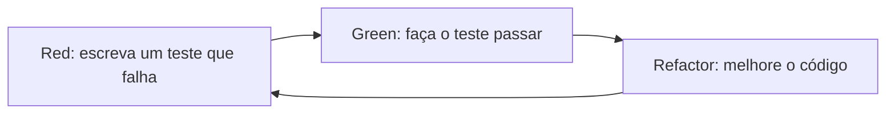

# Test-Driven Development (TDD)

TDD parece um truque de ordem: em vez de escrever o código e depois testar, você escreve o teste primeiro. Só que o efeito colateral mais interessante não é ter testes. É o que acontece com o desenho do código quando você é obrigado a pensar em como ele vai ser usado antes de escrevê-lo.

Esta nota apresenta o ciclo do TDD, mostra um exemplo passo a passo e conecta a prática com design de classes. O conteúdo acompanha as ideias do livro de Maurício Aniche, referência em português sobre o assunto.

## O que é TDD

TDD é a sigla de _Test-Driven Development_, ou desenvolvimento guiado por testes. A regra é simples: nenhuma linha de código de produção nasce sem um teste que falha pedindo por ela.

Escrever o teste primeiro obriga você a decidir como o código será chamado: o nome da função, o que ela recebe, o que devolve. Martin Fowler resume assim: pensar no teste antes força a pensar na interface antes da implementação. Separar "o que o código faz" de "como ele faz" é boa parte do que se chama de bom design.

Por isso o TDD é mais uma prática de design do que de teste. Os testes ficam de brinde, e servem de rede de segurança para refatorar depois. Que isso não substitui o trabalho de procurar bugs é assunto da próxima nota: [Escrever testes vs testar](/labs/qa/praticas/02-escrever-testes-vs-testar/).

## Testes de unidade

TDD costuma ser praticado com testes de unidade, então vale alinhar o que é uma "unidade".

Uma unidade é o menor pedaço de comportamento que faz sentido testar sozinho. Na prática, geralmente é uma função ou uma classe. Um teste de unidade roda rápido (milissegundos), não depende de banco de dados, rede ou arquivos, e diz exatamente onde está o problema quando falha.

Por que escrevê-los:

- dão feedback em segundos, muito antes de subir a aplicação inteira
- protegem o comportamento existente quando alguém mexe no código
- apontam o defeito para uma região pequena, em vez de "algo quebrou no fluxo de compra"
- documentam, com exemplos executáveis, o que o código deveria fazer

No vocabulário de QA, eles ficam na base da pirâmide de testes. Se algum termo aqui soou estranho, a nota de [Terminologias de QA](/labs/qa/fundamentos/03-terminologias-de-qa/) tem o glossário.

## O ciclo red, green, refactor

O TDD funciona em voltas curtas, com três passos:



- **Red**: escreva um teste para o próximo pedacinho de comportamento. Rode e veja falhar. Um teste que nunca falhou não prova nada, porque você não sabe se ele é capaz de detectar o problema.
- **Green**: escreva o código mais simples que faz o teste passar, mesmo que ele pareça bobo.
- **Refactor**: com todos os testes verdes, limpe o código (nomes, duplicação, estrutura) sem mudar o comportamento. Os testes avisam se você quebrou algo.

O erro mais comum é pular a refatoração. O teste passou, dá vontade de seguir para o próximo. Fowler alerta que sem esse passo o resultado é uma colcha de retalhos de código que funciona, mas ninguém quer mexer. O TDD sem refactor entrega os testes e joga fora o ganho de design.

### Exemplo passo a passo

Regra de negócio: compras a partir de R$ 100 ganham 10% de desconto. Os exemplos usam TypeScript com [Vitest](https://vitest.dev), mas a lógica é a mesma em qualquer linguagem.

**Volta 1, red.** Primeiro o teste, antes de existir qualquer código:

```ts
// desconto.test.ts
import { expect, it } from "vitest";
import { calcularDesconto } from "./desconto";

it("não dá desconto para compra abaixo de R$ 100", () => {
  expect(calcularDesconto(99)).toBe(0);
});
```

O teste falha (a função nem existe). **Green**, com o mínimo possível:

```ts
// desconto.ts
export function calcularDesconto(valor: number): number {
  return 0;
}
```

Retornar `0` fixo parece trapaça, mas é de propósito: o teste só exige isso, e o próximo teste vai forçar a versão real.

**Volta 2, red.** Agora o comportamento que faltava:

```ts
it("dá 10% de desconto a partir de R$ 100", () => {
  expect(calcularDesconto(100)).toBe(10);
});
```

Falha, porque a função devolve `0`. **Green**:

```ts
export function calcularDesconto(valor: number): number {
  if (valor >= 100) {
    return valor * 0.1;
  }
  return 0;
}
```

**Refactor.** Com os dois testes verdes, dá para tirar os números mágicos:

```ts
const VALOR_MINIMO_PARA_DESCONTO = 100;
const PERCENTUAL_DE_DESCONTO = 0.1;

export function calcularDesconto(valor: number): number {
  return valor >= VALOR_MINIMO_PARA_DESCONTO
    ? valor * PERCENTUAL_DE_DESCONTO
    : 0;
}
```

Rode os testes de novo: continuam verdes, então a refatoração não mudou o comportamento.

## Simplicidade e baby steps

_Baby steps_ são passos pequenos: um teste, o código mínimo, uma refatoração. O exemplo acima já mostra o efeito: cada volta acrescentou uma única ideia.

Isso importa por alguns motivos:

- quando algo quebra, você sabe que foi nos últimos dois minutos de trabalho
- o código nasce só com o que os testes pedem, sem funcionalidade "que talvez seja útil um dia"
- dá para ajustar o ritmo: em código desconhecido, passos menores; em código conhecido, passos maiores

Uma dica prática para começar: anote uma lista de casos que você imagina que precisa cobrir e escolha o mais simples para o primeiro teste. Casos degenerados (valor zero, lista vazia) costumam ser bons pontos de partida. A lista muda durante o caminho, e tudo bem.

## TDD e design de classes

Quanto mais você pratica TDD, mais percebe que teste difícil de escrever é sintoma de design ruim. Se montar o cenário de um teste exige criar dez objetos, ou ele depende de um banco de dados para verificar uma regra de cálculo, o problema geralmente não está no teste: está no código. O teste é o primeiro cliente da sua classe, e ele reclama alto.

Três conceitos de design aparecem o tempo todo nessa conversa.

### Coesão

Uma classe coesa faz uma coisa só, e todos os métodos dela trabalham em torno disso. Uma classe `Pedido` que calcula total, envia e-mail e gera nota fiscal é pouco coesa. Na hora de testar, você sente: um teste do cálculo do total precisa configurar e-mail e nota fiscal por tabela. O TDD empurra a separar essas responsabilidades.

### Acoplamento

Acoplamento é o quanto uma classe depende de outras. Acoplamento alto significa que mexer em uma peça quebra várias. O caso clássico é a classe que cria suas próprias dependências:

```ts
// Difícil de testar: o gateway real é criado dentro da classe
class Pedido {
  private gateway = new GatewayDePagamento();

  pagar(total: number) {
    return this.gateway.cobrar(total);
  }
}
```

Para testar `Pedido`, você acaba cobrando de verdade no gateway. A saída é receber a dependência de fora (injeção de dependência):

```ts
class Pedido {
  constructor(private gateway: Gateway) {}

  pagar(total: number) {
    return this.gateway.cobrar(total);
  }
}
```

No teste, você passa um gateway falso. Repare que a mudança que facilitou o teste também deixou o design melhor: `Pedido` agora não sabe qual gateway está usando.

### Encapsulamento

Encapsular é esconder os detalhes internos e expor só o comportamento. Testes que cutucam atributos privados ou verificam exatamente quais métodos internos foram chamados quebram toda vez que você refatora, mesmo que o comportamento continue igual. O TDD, por começar pelo "como usar", puxa para testar o que a classe faz, e não como ela faz.

## Qualidade do código de teste

Código de teste também é código: será lido, mantido e refatorado. Teste bagunçado vira o motivo pelo qual o time decide parar de escrever testes.

Alguns cuidados que ajudam bastante:

- **Nome que conta a regra.** `dá 10% de desconto a partir de R$ 100` diz mais que `teste1` ou `calcularDesconto funciona`.
- **Arrange, Act, Assert.** Preparar, executar, verificar, nessa ordem e sem misturar.
- **Um motivo para falhar.** Testes que verificam dez coisas escondem qual delas quebrou.
- **Sem lógica.** `if` e `for` dentro do teste criam a chance de ter bug no próprio teste.
- **Setup repetido vai para uma função de apoio**, mas sem esconder dados que importam para entender o teste.
- **Independência.** Nenhum teste pode depender de outro ter rodado antes.

Testes lentos, instáveis (os famosos _flaky_) ou que exigem ambiente especial também entram na conta da qualidade. Um teste em que ninguém confia é pior que nenhum teste.

## TDD e testes de integração

O ciclo red, green, refactor funciona melhor com testes de unidade, por serem rápidos. Mas parte do sistema só faz sentido integrada: uma consulta SQL, a chamada a outro serviço, a serialização de uma resposta.

Uma divisão que costuma funcionar:

- **regras de negócio**: testes de unidade guiados por TDD, com dependências falsas
- **bordas do sistema** (banco, filas, HTTP): poucos testes de integração, que verificam se a peça conversa direito com o mundo real
- **fluxos completos**: uma quantidade pequena de testes ponta a ponta, como os que se escrevem com [Playwright](/labs/qa/automacao/01-framework-playwright-typescript/)

Nada impede de escrever o teste de integração primeiro, também no estilo TDD. Só fica mais lento, então o ciclo fica menos "de segundos" e mais "de minutos". Quando o contato é entre serviços, ainda existe outra opção: os [testes de contrato](/labs/qa/praticas/05-testes-de-contrato/).

## Quando não usar TDD

TDD não é obrigação em todo trecho de código, e o próprio livro de Aniche dedica um capítulo a isso. Situações em que ele rende pouco:

- **Protótipo descartável ou experimento** para descobrir se algo é possível. Se o código vai para a lixeira amanhã, os testes vão junto.
- **Código de cola**, que só repassa dados de um lugar para outro, sem regra própria.
- **Detalhes visuais**, como saber se um botão ficou bonito. Ali, o olho de uma pessoa (ou testes de regressão visual) resolve melhor.
- **Legado sem pontos de teste**. Antes de guiar por testes, pode ser preciso um passo anterior de "abrir espaço" no código.

O critério prático: se o teste primeiro ajuda você a pensar no design ou a proteger uma regra que importa, use. Se só adiciona burocracia, deixe passar.

## Adotando testes unitários no time

Quase todo mundo concorda que testes de unidade são bons. Isso não torna mais fácil escrevê-los, nem faz o time inteiro topar. O episódio #QAnsei sobre o tema, com uma dev backend e uma profissional da Thoughtworks, gira em torno justamente dessa distância entre saber o valor e conseguir praticar.

Algumas ideias que costumam ajudar quando a adoção emperra:

- **Começar pelo que dói.** Todo bug corrigido vira um teste que reproduz o bug antes da correção. Em pouco tempo o time percebe a rede de segurança se formando.
- **Código novo primeiro.** Exigir testes em código legado inteiro é a receita para desistir. Comece pelas mudanças novas.
- **Rodar na esteira de CI**, para o teste ser parte do fluxo e não uma tarefa extra da pessoa mais chata do time.
- **Testes rápidos e confiáveis.** Uma suíte lenta ou instável cria o hábito de ignorar falhas.
- **Programar em par** com alguém mais experiente é a forma mais curta de aprender a escrever bons testes.
- **Evitar meta de cobertura como imposição.** Perseguir porcentagem gera teste sem asserção, só para "passar por cima" das linhas.

## Referências

- [Test-Driven Development: Teste e Design no Mundo Real](https://www.casadocodigo.com.br/products/livro-tdd) - Maurício Aniche, Casa do Código, pt-BR
- [Test Driven Development](https://martinfowler.com/bliki/TestDrivenDevelopment.html) - Martin Fowler, en
- [Unit Tests na perspectiva de desenvolvedores #QAnsei #03](https://www.youtube.com/watch?v=ZdDyae2eAwo) - Agile Testers, pt-BR
