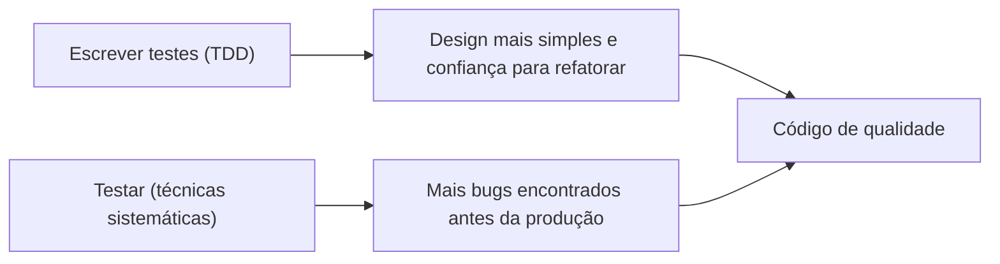
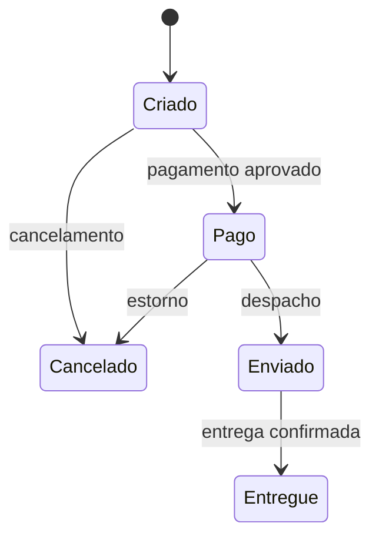

# Escrever Testes vs Testar

Um time pode ter 90% de cobertura, uma suíte enorme e ainda assim entregar bug em produção. Não é contradição: escrever testes e testar são atividades diferentes, e a maioria das equipes pratica só a primeira.

A nota segue as ideias da palestra "Escrever testes vs testar", de Maurício Aniche (professor na TU Delft e autor de livros sobre testes), e junta com o que já aparece no restante do lab.

## Duas atividades diferentes

**Escrever testes** é o que acontece no [TDD](/labs/qa/praticas/01-test-driven-development/): você escreve um teste, faz passar, refatora. O foco é o ritmo de trabalho, o design do código e a confiança para mexer nele depois. Quem escreve teste desse jeito costuma testar os casos que veio à cabeça na hora, o que é natural e, sozinho, insuficiente.

**Testar** é procurar bugs de forma sistemática. A pergunta deixa de ser "o código faz o que eu imaginei?" e vira "onde esse código pode estar errado?". Para responder, existem técnicas com nome e método, várias delas pouco ensinadas em quem aprende só a escrever teste.

Uma comparação ajuda: TDD é um bom jeito de andar de bicicleta com capacete e freio. Testar é olhar o mapa e conferir se você não vai cair em um buraco que nunca apareceu no caminho de casa.

Uma não substitui a outra:

- só escrever testes deixa passar os casos que ninguém pensou em escrever
- só testar, sem o ritmo do TDD, tende a deixar o código difícil de testar e o design mais frágil



As seções abaixo passam pelas técnicas que a palestra apresenta como o outro lado da moeda.

## Análise do domínio e testes de limites

O ponto de partida é olhar para o **domínio**: quais valores de entrada existem e como o programa reage a cada faixa deles. Bugs gostam de morar nas fronteiras, porque é ali que um `>` acaba escrito no lugar de `>=`.

Exemplo: um site libera conteúdo para maiores de 18 anos.

```ts
export function podeAcessar(idade: number): boolean {
  return idade >= 18;
}
```

Se o limite é 18, testar só com 10 e 40 anos dá uma falsa sensação de segurança, porque os dois passam mesmo com o `>` errado. Os casos que importam estão em volta do limite: um pouco abaixo, exatamente nele e um pouco acima (17, 18 e 19; na palestra, o exemplo é "se x > 10, teste 9, 10 e 11").

```ts
import { expect, it } from "vitest";
import { podeAcessar } from "./acesso";

it.each([
  [17, false],
  [18, true],
  [19, true],
])("idade %i: acesso liberado = %s", (idade, esperado) => {
  expect(podeAcessar(idade)).toBe(esperado);
});
```

Duas técnicas de caixa-preta andam juntas aqui: a partição de equivalência (dividir as entradas em grupos que o programa trata igual e testar um representante de cada) e a análise de valor limite. As duas estão explicadas em [Terminologias de QA](/labs/qa/fundamentos/03-terminologias-de-qa/).

## Modelagem do sistema

Quando o comportamento é complexo, ajuda criar um modelo simplificado antes de sair escrevendo casos. Pode ser uma tabela de decisão, um fluxograma ou uma máquina de estados. O modelo é uma abstração que deixa à mostra as regras e as combinações que você teria que descobrir aos poucos.

Pegue o status de um pedido:



Cada seta vira pelo menos um teste. E o desenho mostra as perguntas que faltam: dá para cancelar um pedido já `Enviado`? O que acontece se o pagamento for aprovado duas vezes? Muitos bugs aparecem no papel, antes de virar código.

## Cobertura estrutural

Cobertura é a medida de quanto do código os testes executam. A **cobertura estrutural** olha para dentro do código: linhas, ramos de `if`, condições.

O uso mais útil não é como meta, e sim como lupa. Um relatório mostra quais trechos nenhum teste tocou. Muitos desses trechos existem porque o programador tratou casos que o requisito nunca mencionou: um `else` para um valor estranho, um tratamento de erro. São candidatos a bug, porque ninguém decidiu o que deveria acontecer ali.

Alguns cuidados:

- cobertura alta não prova qualidade: um teste sem asserção "cobre" a linha e não verifica nada
- cobertura baixa prova pouca coisa: é um sinal para investigar, não para culpar
- cobertura de ramos (branch coverage) diz mais que a de linhas, porque um `if` sem o caso `else` testado tem a linha coberta e o comportamento não

Usar a cobertura para descobrir o que falta testar dá bom resultado. Transformar em meta obrigatória do time costuma dar o efeito contrário.

## Design por contrato

Design por contrato é uma ideia de Bertrand Meyer (a linguagem Eiffel foi criada em torno dela): cada operação de uma classe assume compromissos explícitos.

- **Pré-condições**: o que precisa ser verdade antes de chamar (quem chama é responsável)
- **Pós-condições**: o que a operação garante depois de executar (quem implementa é responsável)
- **Invariantes**: o que precisa ser verdade em qualquer momento de vida do objeto

Exemplo com um saque:

```ts
class Conta {
  constructor(private saldo: number) {}

  sacar(valor: number): void {
    // pré-condições
    if (valor <= 0) throw new Error("O valor do saque deve ser positivo");
    if (valor > this.saldo) throw new Error("Saldo insuficiente");

    const saldoAntes = this.saldo;
    this.saldo -= valor;

    // pós-condição: o saldo diminuiu exatamente o valor sacado
    if (this.saldo !== saldoAntes - valor)
      throw new Error("Pós-condição violada");
    // invariante: o saldo nunca fica negativo
    if (this.saldo < 0) throw new Error("Invariante violada");
  }
}
```

Para quem testa, os contratos servem de mapa: cada pré-condição é um caso negativo (o que acontece com valor zero, negativo, maior que o saldo?), e cada pós-condição e invariante é uma verificação que pode ser feita depois de qualquer teste.

Atenção com a confusão de nomes: **design por contrato** trata das promessas dentro do código, entre quem chama e quem implementa. **Teste de contrato** trata do acordo entre dois serviços diferentes. São ideias diferentes, e a segunda tem nota própria: [Testes de contrato](/labs/qa/praticas/05-testes-de-contrato/).

## Teste de mutação

Uma pergunta incômoda: se eu estragar o código de propósito, meus testes percebem?

Teste de mutação responde isso. Uma ferramenta introduz pequenos defeitos no código de produção (troca `>=` por `>`, `+` por `-`, remove uma linha) e roda a suíte para cada versão alterada, chamada de **mutante**.

- Se algum teste falha, o mutante foi **morto**. Bom sinal.
- Se todos os testes continuam passando, o mutante **sobreviveu**. A suíte não notou a mudança.

A proporção de mutantes mortos vira o _mutation score_. Mutante sobrevivente é uma pista direta: ou falta um teste, ou falta uma asserção. No exemplo da idade, o mutante `idade > 18` sobrevive se os testes usarem só 10 e 40 anos, e morre quando o teste com exatamente 18 entra. Testes de limite e teste de mutação se completam.

Para JavaScript e TypeScript, a ferramenta mais conhecida é o [Stryker](https://stryker-mutator.io/docs/). Vale a ressalva: rodar mutação em tudo é lento, então costuma ser aplicado em partes críticas do código.

## Geração automática de testes

Outra linha de pesquisa é gerar testes por ferramenta. Duas que aparecem na palestra:

- **EvoSuite**: gera testes de unidade para código Java, usando algoritmos de busca que tentam alcançar o máximo de cobertura.
- **EvoMaster**: gera testes de sistema para APIs (REST e outras), chamando os endpoints e analisando as respostas.

Elas ajudam a encontrar coisas como exceções inesperadas e casos de borda que ninguém pensou em escrever. O limite é que a ferramenta sabe o que o código faz, mas não o que ele deveria fazer. Um teste gerado a partir de um comportamento errado aprova o erro. Por isso a saída deve passar por revisão de gente, e a técnica complementa, e não substitui, o trabalho de quem especifica os casos.

## Como combinar as técnicas no dia a dia

Ninguém precisa usar tudo em toda funcionalidade. Uma rotina realista:

1. Escrever o código guiado por testes (TDD), pelo design e pelo ritmo.
2. Olhar as entradas e listar as faixas de valores e os limites; acrescentar os casos que faltam.
3. Se a regra tem estados ou combinações, desenhar o modelo e derivar casos dele.
4. Conferir o relatório de cobertura para achar trechos que nenhum teste tocou.
5. Em partes críticas, rodar teste de mutação para ver se a suíte percebe defeitos.

Testar bem é dar mais atenção ao que pode dar errado do que ao que você já sabe que funciona.

## Referências

- [Escrever testes vs testar](https://speakerdeck.com/mauricioaniche/escrever-testes-vs-testar) - Maurício Aniche, pt-BR
- [Keynote - Escrever Testes vs. Testar](https://www.youtube.com/watch?v=Bhqk5H1fZv8) - Maurício Aniche, pt-BR
- [Testes automatizados de software: um guia prático](https://www.bvirtual.com.br/NossoAcervo/Publicacao/212643) - Maurício Aniche, Casa do Código, pt-BR
- [Effective Software Testing](https://www.manning.com/books/effective-software-testing) - Maurício Aniche, Manning, en
- [Documentação do Stryker sobre mutation testing](https://stryker-mutator.io/docs/) - Stryker, en
