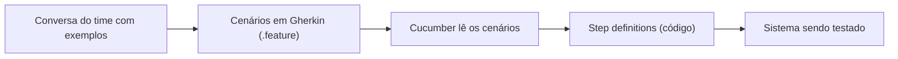

# Gherkin e Cucumber

Cenários de teste escritos em português (ou em qualquer idioma humano) que qualquer pessoa do time consegue ler e, ao mesmo tempo, um computador consegue executar. É a proposta do Gherkin com o Cucumber, e ela funciona muito bem quando os cenários são bem escritos e muito mal quando não são.

Esta nota apresenta a linguagem e as práticas que mantêm os cenários legíveis e fáceis de manter. Os erros mais comuns ficam na nota seguinte: [Anti-padrões de Gherkin](/labs/qa/praticas/04-anti-padroes-de-gherkin/).

## O que são Gherkin e Cucumber

Três nomes que costumam vir misturados:

- **BDD** (_Behavior Driven Development_) é a prática: o time conversa sobre o comportamento esperado do sistema usando exemplos concretos, antes de construir.
- **Gherkin** é a linguagem em que esses exemplos são escritos: texto simples, com poucas palavras reservadas, em arquivos `.feature`.
- **Cucumber** é a ferramenta que lê os arquivos Gherkin e executa cada passo chamando código. Existe em várias linguagens; em JavaScript e TypeScript, o pacote é o `@cucumber/cucumber`.



### Documentação viva

O ponto forte do conjunto é a **documentação viva**. Um cenário Gherkin descreve uma regra do sistema em linguagem de negócio, e como ele é executado a cada mudança, não fica desatualizado em silêncio: se a regra mudar e o cenário não, o teste quebra.

Isso muda o critério para escrever. Cenário bom é o que uma pessoa de produto lê e entende, não o que mais detalha cliques na tela. O livro _Cucumber e Rspec_, de Hugo Baraúna, defende que o Cucumber é mais uma ferramenta de documentação do que de automação de testes, e boa parte das práticas abaixo vem dessa ideia.

Uma ressalva honesta: o Gherkin adiciona uma camada entre o teste e o código. Quando só pessoas de QA leem os cenários, essa camada pode custar mais do que rende, e um teste direto, como os do [Playwright](/labs/qa/automacao/01-framework-playwright-typescript/), fica mais simples. O ganho aparece quando produto, dev e QA usam os cenários como linguagem comum.

## Estrutura de uma feature

Uma feature é um arquivo `.feature` com uma funcionalidade e seus cenários.

```gherkin
# language: pt
Funcionalidade: Saque em conta corrente
  Para poder retirar dinheiro quando precisar
  Como cliente do banco
  Quero sacar valores da minha conta

  Cenário: Saque dentro do saldo disponível
    Dado que a conta tem saldo de 500 reais
    Quando o cliente saca 200 reais
    Então o saldo restante é de 300 reais
```

O `# language: pt` na primeira linha ativa as palavras-chave em português (`Funcionalidade`, `Cenário`, `Dado`, `Quando`, `Então`). Em inglês elas são `Feature`, `Scenario`, `Given`, `When` e `Then`. Os exemplos desta nota e da próxima usam português, mas o comportamento é idêntico.

As três palavras principais têm papéis diferentes:

- **Given (Dado)**: o contexto inicial, o sistema em um estado conhecido. É o passado.
- **When (Quando)**: a ação ou o evento que acontece. É o presente.
- **Then (Então)**: o resultado esperado, verificado com asserções. É um futuro próximo.

### Step definitions

Cada passo do cenário é ligado a um trecho de código, a _step definition_. Em TypeScript com `@cucumber/cucumber`:

```ts
import { Given, When, Then } from "@cucumber/cucumber";
import assert from "node:assert";
import { Conta } from "../../src/conta";

Given("que a conta tem saldo de {int} reais", function (saldo: number) {
  this.conta = new Conta(saldo);
});

When("o cliente saca {int} reais", function (valor: number) {
  this.conta.sacar(valor);
});

Then("o saldo restante é de {int} reais", function (esperado: number) {
  assert.strictEqual(this.conta.saldo, esperado);
});
```

O `{int}` captura o número do texto do passo e entrega como argumento. Um detalhe que costuma surpreender: o Cucumber **não considera** `Given`, `When` ou `Then` na hora de achar a step definition, só o texto. Por isso não dá para ter um `Given` e um `Then` com o mesmo texto. As palavras existem para o humano que lê, o que dá ainda mais peso a usá-las direito.

## Cenários declarativos x imperativos

Um cenário **imperativo** descreve o passo a passo de como testar. Um cenário **declarativo** descreve o comportamento que importa. A recomendação da documentação oficial do Cucumber é descrever o _quê_, não o _como_.

Imperativo:

```gherkin
Cenário: Cadastro de usuário
  Dado que estou na tela de cadastro
  Quando clico no botão "Novo usuário"
  E preencho o campo "Nome" com "Ana"
  E preencho o campo "E-mail" com "ana@exemplo.com"
  E preencho o campo "Senha" com "segredo123"
  E preencho o campo "Telefone" com "11999990000"
  E preencho o campo "Cidade" com "São Paulo"
  E clico no botão "Salvar"
  Então vejo a mensagem "Usuário salvo"
```

Declarativo:

```gherkin
Cenário: Cadastro de usuário com dados válidos
  Dado que estou na tela de cadastro
  Quando preencho os dados do usuário
  E confirmo o cadastro
  Então vejo a mensagem "Usuário salvo"
```

O segundo diz o que se quer validar: o cadastro funciona. Os campos, a ordem e os botões ficam na step definition. Se a tela mudar (um campo novo, um botão renomeado), só o código dos passos muda, e o arquivo `.feature` continua igual.

O caminho inverso também é um problema. Declarativo demais vira isto:

```gherkin
Cenário: Cadastro de usuário
  Dado que estou logado
  Quando preencho tudo
  Então vejo uma mensagem
```

Ninguém aprende nada com esse cenário: não diz qual regra está sendo validada nem o que significa "uma mensagem". A régua é a pergunta "uma pessoa de negócio entende que regra é essa?".

## Background

Quando os mesmos passos se repetem no início de todos os cenários de uma feature, dá para movê-los para o `Contexto` (`Background`), que roda antes de cada cenário.

Sem Background, a repetição pesa:

```gherkin
Cenário: Cadastro com todos os dados
  Dado que estou logado como administrador
  E que estou na tela de cadastro de usuários
  Quando preencho os dados do usuário
  Então vejo a mensagem "Usuário salvo"

Cenário: Cadastro sem e-mail
  Dado que estou logado como administrador
  E que estou na tela de cadastro de usuários
  Quando preencho os dados do usuário, exceto o e-mail
  Então vejo a mensagem "E-mail é obrigatório"
```

Com Background:

```gherkin
Contexto:
  Dado que estou logado como administrador
  E que estou na tela de cadastro de usuários

Cenário: Cadastro com todos os dados
  Quando preencho os dados do usuário
  Então vejo a mensagem "Usuário salvo"

Cenário: Cadastro sem e-mail
  Quando preencho os dados do usuário, exceto o e-mail
  Então vejo a mensagem "E-mail é obrigatório"
```

O princípio é o mesmo do DRY em código: uma mudança no contexto vira uma edição, em vez de uma por cenário.

Dois pontos de atenção:

- O Background é executado **depois** dos hooks `Before`. Se os dois existirem, o `Before` roda primeiro e o contexto em seguida.
- Ele vale para todos os cenários do arquivo. Se só alguns precisam daquele contexto, ou se a lista de passos virou um parágrafo, é sinal de que ele não é o lugar certo. Mantenha-o curto.

## Scenario Outline e Examples

Quando o mesmo cenário se repete com valores diferentes, escrever um por valor não escala. O `Esquema do Cenário` (_Scenario Outline_, também chamado de _Scenario Template_) descreve o cenário uma vez e roda para cada linha de uma tabela de `Exemplos`.

```gherkin
Esquema do Cenário: Desconto por valor da compra
  Dado que o carrinho tem o total de <total> reais
  Quando o cliente finaliza a compra
  Então o desconto aplicado é de <desconto> reais

  Exemplos:
    | total | desconto |
    | 99    | 0        |
    | 100   | 10       |
    | 250   | 25       |
```

Os nomes entre `<>` são variáveis, e cada linha da tabela roda como um cenário separado. A primeira linha da tabela tem os nomes das colunas.

Repare que os valores da tabela (99 e 100, logo abaixo e exatamente no limite) são os mesmos casos de [valor limite](/labs/qa/praticas/02-escrever-testes-vs-testar/) que aparecem na técnica de teste. Tabela de exemplos é o lugar natural para eles.

O esquema serve para uma mesma regra com dados diferentes. Regras diferentes pedem cenários diferentes, assunto da nota de [anti-padrões](/labs/qa/praticas/04-anti-padroes-de-gherkin/).

## And e But

Repetir `Given`, `When` ou `Then` em sequência não é errado, mas cansa quem lê:

```gherkin
Cenário: Cadastro sem e-mail
  Dado que estou logado
  Dado que tenho acesso ao cadastro de usuários
  Dado que estou na tela de cadastro
  Quando preencho os demais dados do usuário
  Quando deixo o e-mail em branco
  Quando confirmo o cadastro
  Então vejo a mensagem "E-mail é obrigatório"
```

Com `E` (_And_) e `Mas` (_But_):

```gherkin
Cenário: Cadastro sem e-mail
  Dado que estou logado
  E que tenho acesso ao cadastro de usuários
  E que estou na tela de cadastro
  Quando preencho os demais dados do usuário
  Mas deixo o e-mail em branco
  E confirmo o cadastro
  Então vejo a mensagem "E-mail é obrigatório"
```

`And` e `But` herdam o tipo do passo anterior. Para o Cucumber a diferença não existe (só o texto conta), então é uma escolha puramente de leitura. O `But` é bom para sinalizar uma exceção ou um contraste, como no exemplo.

## Tags

Tags são etiquetas com `@` antes de `Feature` ou `Scenario`. Elas agrupam cenários independentemente da estrutura de pastas.

```gherkin
@cadastro @wip
Funcionalidade: Cadastro de usuários

  @usuario_basico
  Cenário: Cadastro com todos os dados
    Quando preencho os dados do usuário
    Então vejo a mensagem "Usuário salvo"
```

Uma tag colocada na feature é herdada por todos os cenários dela; a tag no cenário vale só para ele. Usos comuns:

- **Filtrar a execução**: rodar só os cenários rápidos (`@smoke`), só os de uma área (`@cadastro`) ou tudo, menos o que ainda não está pronto
- **Marcar cenários em andamento** com `@wip` (_work in progress_), para que um cenário meio escrito não quebre a suíte inteira
- **Identificar cenários lentos ou instáveis**, para tratá-los à parte

No `cucumber-js`, o filtro usa expressões com `and`, `or` e `not`:

```bash
npx cucumber-js --tags "@smoke and not @wip"
```

Não exagere: tag demais vira um segundo sistema de organização que ninguém consegue manter.

## Escrita colaborativa

Cenário escrito sozinho por uma pessoa costuma refletir só a visão dela. A prática mais comum para evitar isso é reunir três perspectivas antes de escrever qualquer código, conhecida como **Three Amigos**:

- **Produto**: sabe qual problema de negócio está sendo resolvido e o que é sucesso
- **Dev**: sabe o que é viável e onde estão as complicações técnicas
- **QA**: pergunta "e se...?", procura os casos de borda e os fluxos alternativos

A conversa parte de exemplos concretos ("e se o cliente sacar mais do que tem?"), e os exemplos viram os cenários. Boa parte do valor do BDD está na conversa: se o time discutiu e discordou antes do código, o cenário nasce como consenso, não como um arquivo escrito às pressas no fim da sprint.

## Referências

- [Better Gherkin](https://cucumber.io/docs/bdd/better-gherkin/) - Cucumber, en
- [Gherkin Reference](https://cucumber.io/docs/gherkin/reference/) - Cucumber, en
- [5 boas práticas para uso de Cucumber](https://web.archive.org/web/2020/http://shipit.resultadosdigitais.com.br/blog/5-boas-praticas-para-uso-de-cucumber/) - Ana Paula Vale, Ship It! (Resultados Digitais), pt-BR
