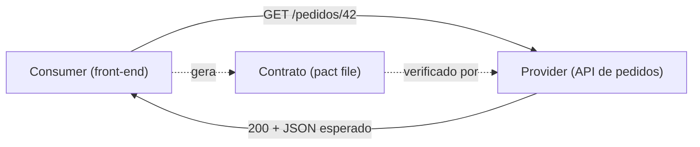
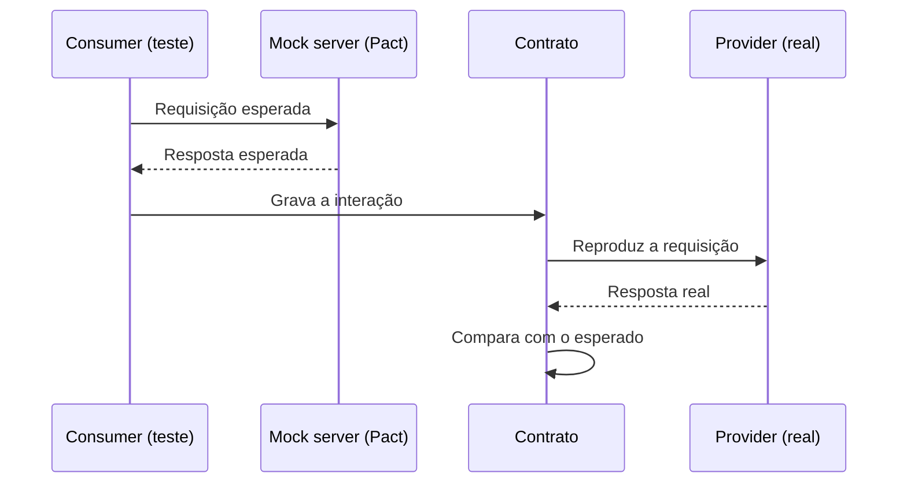

# Testes de Contrato

Duas equipes, dois serviços. A equipe de pedidos renomeia o campo `nome` para `nomeCompleto` na resposta da API, os testes dela passam, o deploy sai. Do outro lado, o front-end continua lendo `nome`, e a tela de pedidos aparece com o cliente em branco. Nenhum teste quebrou, e a aplicação quebrou.

Teste de contrato existe para pegar esse tipo de problema antes do deploy, sem precisar subir todos os serviços juntos.

## O problema que o teste de contrato resolve

Em arquiteturas com vários serviços (microsserviços, um front-end que fala com uma API, serviços que trocam mensagens), cada peça é testada isoladamente: os testes de unidade e de integração de cada equipe ficam verdes. O que ninguém testa é a **conversa entre as peças**.

O caminho tradicional para testar essa conversa é o teste de integração ou ponta a ponta em um ambiente com tudo no ar. Funciona, mas tem custos conhecidos:

- exige que os serviços já estejam implantados, então o bug é descoberto depois do merge
- é lento e difícil de coordenar entre times
- o ambiente é frágil: um serviço fora do ar ou uma massa de dados inconsistente derruba o teste que nada tem a ver com a mudança
- quando falha, é difícil saber qual lado quebrou o acordo

O teste de contrato troca isso por outra pergunta: **"eu e a outra equipe concordamos sobre como conversar, e cada um cumpre a sua parte?"** Essa pergunta pode ser respondida separadamente por cada lado, em segundos, no pipeline de cada serviço, e antes do deploy.

## O que é um teste de contrato

Um teste de contrato verifica se um serviço que consome e um serviço que fornece respeitam o acordo entre eles: quais requisições são feitas e quais respostas voltam. Cada lado é testado sozinho, contra o contrato, sem depender de o outro estar no ar.

### Contrato não é o mesmo que schema

Uma confusão comum, e que a palestra do Agile Testers ataca logo no começo, é achar que teste de contrato é validar que o JSON respeita um schema.

- Um **schema** (JSON Schema, OpenAPI) descreve a estrutura de **todas as respostas possíveis** de uma API. Vem do ponto de vista de quem fornece, e sozinho não é um teste: precisa de ferramentas extras para verificar de fato as respostas.
- Um **contrato** registra **exemplos concretos das interações que os consumidores realmente usam**. Se um campo existe no schema mas nenhum consumidor o lê, ele não está no contrato, e mudá-lo não quebra ninguém. Se um consumidor depende de um campo, o contrato registra isso, e removê-lo faz o teste falhar.

Os dois não competem. A própria documentação do Pact fala em usar OpenAPI e Pact juntos: um garante conformidade com a especificação pública, o outro garante que os requisitos conhecidos dos consumidores continuam sendo atendidos.

### Dois sentidos de "contract test"

O termo aparece com dois significados, e vale saber os dois para não ler um artigo pensando no outro.

1. **Contract test como verificação de test double.** É o sentido descrito por Martin Fowler: um conjunto de testes, executado periodicamente (por exemplo, uma vez por dia), que confere se o seu _test double_ de um serviço externo responde igual ao serviço real. Ele protege contra o mock desatualizado.
2. **Consumer-driven contract testing.** O sentido usado pelo Pact e pela palestra: o contrato é gerado a partir do que o consumidor precisa, e o provedor verifica que cumpre esse contrato. É o que esta nota trata daqui para a frente.

O próprio Fowler recomenda, para reduzir o risco de quebras inesperadas, evoluir para o modelo dirigido pelo consumidor e compartilhar os testes com o time do serviço externo. Por isso os dois sentidos convivem.

E há um terceiro nome parecido que não tem relação: o **design por contrato** (pré-condições, pós-condições e invariantes dentro de uma classe), que aparece em [Escrever testes vs testar](/labs/qa/praticas/02-escrever-testes-vs-testar/).

## Consumer, provider e contrato

Três palavras-chave, que costumam ficar em inglês:

- **Consumer** (consumidor): o serviço que faz a requisição. Pode ser um front-end, um app mobile ou outro serviço.
- **Provider** (provedor): o serviço que responde. A API que fornece os dados.
- **Contrato** (_pact file_, no Pact): o arquivo, geralmente em JSON, que registra cada interação combinada: a requisição que o consumidor faz e a resposta mínima que ele espera.



## Consumer-driven contract testing

"Dirigido pelo consumidor" quer dizer que o contrato nasce do que o consumidor precisa. A equipe do front-end escreve, no teste dela, "quando eu chamar `GET /pedidos/42`, preciso de um JSON com `id` e `nomeCliente`". Esse pedido vira o contrato, que a equipe da API precisa cumprir.

O fluxo do Pact, em quatro passos:

1. **Teste do consumidor.** O consumidor descreve as interações esperadas e roda seu código real contra um provedor falso (mock server) fornecido pelo Pact. O teste confere se o consumidor sabe lidar com aquela resposta.
2. **Geração do contrato.** Se os testes passam, o Pact escreve o arquivo com todas as interações registradas.
3. **Verificação do provedor.** O contrato é reproduzido contra o provedor **real**: cada requisição é enviada e a resposta verdadeira é comparada com a resposta mínima esperada. Campos a mais na resposta não atrapalham, só os que o consumidor declarou precisar são verificados.
4. **Compartilhamento e decisão de deploy** (próxima seção).



### Exemplo de teste do consumidor

Em TypeScript, com o [pact-js](https://github.com/pact-foundation/pact-js) e o Vitest. A API do pacote muda entre versões, então confira a documentação da versão que você instalar.

```ts
import { MatchersV3, PactV3 } from "@pact-foundation/pact";
import { expect, it } from "vitest";
import { buscarPedido } from "./clientePedidos";

const provider = new PactV3({
  consumer: "loja-web",
  provider: "api-pedidos",
});

it("busca um pedido existente", () => {
  provider
    .given("existe o pedido 42")
    .uponReceiving("uma consulta ao pedido 42")
    .withRequest({ method: "GET", path: "/pedidos/42" })
    .willRespondWith({
      status: 200,
      headers: { "Content-Type": "application/json" },
      body: {
        id: 42,
        nomeCliente: MatchersV3.string("Ana"),
      },
    });

  return provider.executeTest(async (mockServer) => {
    const pedido = await buscarPedido(mockServer.url, 42);
    expect(pedido.nomeCliente).toBe("Ana");
  });
});
```

Detalhes que valem atenção:

- `given('existe o pedido 42')` é o **estado do provedor**: uma frase que o provedor usa, na verificação, para preparar seus dados.
- `MatchersV3.string('Ana')` diz que o contrato exige uma string, e não exatamente `'Ana'`. Sem matchers, o contrato fica preso a valores específicos e quebra à toa.
- O que está no `body` é o que o consumidor de fato usa. Se a tela só mostra o nome, não coloque o endereço inteiro no contrato.

## Pact Broker e can-i-deploy

Contratos precisam chegar até a equipe do provedor sem ninguém enviar arquivo por chat. É o papel do **Pact Broker**, um repositório central de contratos e resultados de verificação. O consumidor publica o contrato lá pelo pipeline, o provedor busca, verifica e publica o resultado.

Com contratos e resultados versionados, o broker sabe responder à pergunta mais útil de todas: **"essa versão pode ir para produção?"** O comando `can-i-deploy` consulta uma matriz com quais versões já foram verificadas entre si:

```bash
pact-broker can-i-deploy --pacticipant loja-web --version 1.4.0 --to-environment production
```

Ele identifica as aplicações integradas, confere se existe um resultado de verificação bem-sucedido entre a versão candidata e as versões que já estão no ambiente de destino, e sai com código 0 (sim) ou 1 (não). Colocado no pipeline antes do deploy, ele funciona como um portão automático: quem tentar publicar uma versão que quebra outro serviço é barrado antes.

O Pact Broker é de código aberto. A PactFlow, empresa ligada ao projeto, oferece uma versão hospedada.

## Testes de contrato, integração e E2E

Cada tipo responde a uma pergunta diferente:

| Tipo       | Pergunta que responde                                            | Onde roda                          |
| ---------- | ---------------------------------------------------------------- | ---------------------------------- |
| Unidade    | A lógica desta peça está certa?                                  | Local, em milissegundos            |
| Contrato   | Os dois lados cumprem o acordo de comunicação?                   | Local, no pipeline de cada serviço |
| Integração | Esta peça conversa direito com o banco, com a fila, com o disco? | Ambiente com a dependência real    |
| E2E        | O fluxo completo funciona do ponto de vista do usuário?          | Ambiente integrado, com tudo no ar |

O teste de contrato **não** substitui os outros. Ele não valida a lógica de negócio do provedor (isso é assunto dos testes de unidade dele), não mede desempenho e não verifica o fluxo do usuário. O que ele faz é tirar do E2E a responsabilidade de descobrir quebras de comunicação. Com isso, a suíte E2E, que é lenta e frágil, pode ficar menor e concentrada nos fluxos críticos, que são os testes que se escrevem com [Playwright](/labs/qa/automacao/01-framework-playwright-typescript/).

## Quando usar e quando não usar

A documentação do Pact é direta sobre onde a técnica rende.

Faz sentido quando:

- a sua organização controla os dois lados, ou tem boa comunicação com quem controla
- os dois lados estão em desenvolvimento ativo
- o time provedor consegue controlar seus dados de teste com facilidade
- o consumidor influencia o que o provedor precisa entregar
- o número de consumidores por provedor é pequeno o bastante para haver diálogo entre times

Rende pouco quando:

- a API é pública, com consumidores que você nem conhece
- a integração é com terceiros que não vão adotar o contrato
- o serviço só repassa requisições sem validar o conteúdo (algumas APIs pass-through e BFFs)
- o que você quer testar é desempenho ou carga
- as equipes não conversam entre si, porque o contrato depende dessa conversa

Se você chegou até aqui sem um projeto real com microsserviços, tudo bem: o conceito fica mais claro quando se vê a quebra acontecer. Uma boa prática é montar um exemplo mínimo com dois serviços pequenos, quebrar o contrato de propósito e ver o teste do provedor falhar.

## Referências

- [AT Talks: Teste de Contrato com Pact](https://www.youtube.com/watch?v=1c2JmM9dafA) - Paulo Gonçalves, Agile Testers, pt-BR
- [Testes de Contratos com PACT #1 - Conceitos](https://www.zup.com.br/blog/testes-de-contratos-com-pact-1-conceitos) - Zup, pt-BR
- [What is Pact good for?](https://docs.pact.io/getting_started/what_is_pact_good_for) - Pact Foundation, en
- [How Pact works](https://docs.pact.io/getting_started/how_pact_works) - Pact Foundation, en
- [ContractTest](https://martinfowler.com/bliki/ContractTest.html) - Martin Fowler, en
